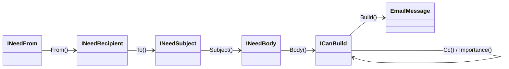

> **Free sample chapter.** This is the full Builder chapter from *Design Patterns That Deliver*. The remaining chapters - Decorator, Strategy, Adapter, Mediator (and more) - unlock when you own the book.

## The real problem isn't "too many constructor arguments"

Most tutorials sell the Builder pattern as a cure for the *telescoping constructor* - five overloads, fifteen parameters, nobody remembers the order. That framing is twenty years out of date for C#.

The real problem the Builder solves is **constructing an object that has rules** - an object that is only valid in certain shapes, that may be assembled across several steps, or whose *required* parts must be supplied before anyone is allowed to use it. The argument count is a symptom. The disease is **"it's possible to create an invalid instance."**

Throughout this chapter we'll build one realistic domain object - an outbound `EmailMessage` - and watch it evolve from a classic GoF builder all the way to a Step Builder the compiler enforces. Here's the product and a value object it depends on:

```csharp
public readonly record struct EmailAddress
{
    public string Value { get; }

    private EmailAddress(string value) => Value = value;

    public static EmailAddress Parse(string value)
    {
        if (string.IsNullOrWhiteSpace(value) || !value.Contains('@'))
            throw new ArgumentException($"'{value}' is not a valid email address.", nameof(value));

        return new EmailAddress(value.Trim().ToLowerInvariant());
    }

    public override string ToString() => Value;
}

public enum Importance { Low, Normal, High }
```

> The `Contains('@')` check is deliberately illustrative - it keeps the value object readable. In production, validate with a real format check (`System.Net.Mail.MailAddress.TryCreate`) or a vetted regex; the *shape* (parse-once, fail-loud, store normalized) is the point, not the predicate.

## First: do you even need a builder?

Modern C# eliminates the most common reason people wrote builders. With `record`, `required`, `init`, and `with`, you get immutable objects, compiler-enforced required members, and cheap copies - for free.

```csharp
public sealed record EmailMessage
{
    public required EmailAddress From { get; init; }
    public required IReadOnlyList<EmailAddress> To { get; init; }
    public required string Subject { get; init; }
    public required string Body { get; init; }

    public IReadOnlyList<EmailAddress> Cc { get; init; } = [];
    public IReadOnlyList<Attachment> Attachments { get; init; } = [];
    public Importance Importance { get; init; } = Importance.Normal;
}
```

```csharp
var email = new EmailMessage
{
    From = EmailAddress.Parse("billing@acme.io"),
    To = [EmailAddress.Parse("customer@example.com")],
    Subject = "Your October invoice",
    Body = renderedHtml,
};

// Need a variation? Don't rebuild it - copy it.
var reminder = email with { Subject = "Reminder: October invoice" };
```

The compiler **already** refuses to compile this if you forget `From`, `To`, `Subject`, or `Body`. For a large share of types, that is the entire job - and writing a builder on top of it is pure ceremony.

> **Rule of thumb:** if a `record` with `required` members expresses your object, *do not write a builder*. Reach for one only when you need something the language can't give you for free: non-trivial invariants, multi-step or conditional assembly, construction *recipes*, or compile-time-enforced required steps. The rest of this chapter is each of those, in order.

---

## Solution - the Classic Builder (GoF)

The original Gang of Four builder separates a `Builder` abstraction from one or more *concrete builders*, so the same construction process can produce different representations. In C# it looks like this:

```csharp
public interface IEmailBuilder
{
    void SetFrom(EmailAddress from);
    void AddRecipient(EmailAddress to);
    void SetSubject(string subject);
    void SetBody(string body);
    EmailMessage Build();
}

public sealed class EmailBuilder : IEmailBuilder
{
    private EmailAddress _from;
    private readonly List<EmailAddress> _to = [];
    private string _subject = "";
    private string _body = "";

    public void SetFrom(EmailAddress from) => _from = from;
    public void AddRecipient(EmailAddress to) => _to.Add(to);
    public void SetSubject(string subject) => _subject = subject;
    public void SetBody(string body) => _body = body;

    public EmailMessage Build() => new()
    {
        From = _from,
        To = [.. _to],
        Subject = _subject,
        Body = _body,
    };
}
```

This is faithful to the textbook, and it already shows the pattern's core value: construction logic lives in one place, and the product (`EmailMessage`) stays free of assembly concerns. But the void-returning setters are clumsy - every call is its own statement. In idiomatic C#, we can do much better.

> **Read this honestly:** notice that `EmailBuilder.Build()` will happily hand you an `EmailMessage` with a `default` `From` (whose `Value` is `null`) and an empty subject if the caller forgets a setter. The `required` keyword is satisfied - the builder *did* assign every member - it just assigned junk. **A plain builder trades the compiler's required-member guarantee for ergonomics.** Keep that in mind: every builder below has to win that guarantee back somehow, and we'll show two ways (a Step Builder at compile time, a validator at runtime).

---

## Fluent Builder (my personal choice)

Return `this` from each method and construction becomes a single, readable expression. This is the form you'll reach for 90% of the time.

```csharp
public sealed class FluentEmailBuilder
{
    private EmailAddress _from;
    private readonly List<EmailAddress> _to = [];
    private readonly List<EmailAddress> _cc = [];
    private readonly List<Attachment> _attachments = [];   // used by the nested builder below
    private string _subject = "";
    private string _body = "";
    private Importance _importance = Importance.Normal;

    public FluentEmailBuilder From(EmailAddress from)        { _from = from;          return this; }
    public FluentEmailBuilder To(EmailAddress to)            { _to.Add(to);           return this; }
    public FluentEmailBuilder Cc(EmailAddress cc)            { _cc.Add(cc);           return this; }
    public FluentEmailBuilder Subject(string subject)       { _subject = subject;    return this; }
    public FluentEmailBuilder Body(string body)             { _body = body;          return this; }
    public FluentEmailBuilder Importance(Importance value)  { _importance = value;   return this; }

    public EmailMessage Build() => new()
    {
        From = _from,
        To = [.. _to],
        Cc = [.. _cc],
        Attachments = [.. _attachments],
        Subject = _subject,
        Body = _body,
        Importance = _importance,
    };
}
```

```csharp
EmailMessage email = new FluentEmailBuilder()
    .From(EmailAddress.Parse("billing@acme.io"))
    .To(EmailAddress.Parse("customer@example.com"))
    .Cc(EmailAddress.Parse("audit@acme.io"))
    .Subject("Your October invoice")
    .Body(renderedHtml)
    .Importance(Importance.High)
    .Build();
```

**Why this is the default choice:** method chaining reads top-to-bottom like a specification, there's no Director required, and `Build()` is the single place where the immutable product is produced. Note the `[.. _to]` copy on build - we'll come back to why that detail is non-negotiable.

> **The trade-off you're accepting.** The Fluent Builder is ergonomic but *not* compile-time safe: like the classic form, `new FluentEmailBuilder().Build()` with nothing set compiles and runs. You have two honest answers, and you pick based on who the caller is:
>
> - If the builder is consumed **inside your own codebase**, add a runtime guarantee - the FluentValidation step later in this chapter, run inside `Build()`.
> - If the builder is a **public API other teams call**, make the *compiler* enforce presence and order - the Step Builder later in this chapter.
>
> A Fluent Builder with no validation is the most common way teams *think* they've made invalid states unrepresentable while having done nothing of the sort. Don't ship one.

> **Thread safety:** a builder is mutable and *not* thread-safe - never share one instance across threads. Create one per construction (they're cheap) and let `Build()` hand out the immutable, freely-shareable result.

---

## Director - encapsulating construction recipes

A **Director** is worth adding when the *same* construction recipe is repeated across the codebase. Instead of every caller remembering how to assemble a "password reset" or an "invoice" email, the Director owns those recipes and the builder owns the mechanics.

```csharp
public sealed class EmailDirector(EmailAddress noReply)
{
    public EmailMessage PasswordReset(EmailAddress to, Uri resetLink) =>
        new FluentEmailBuilder()
            .From(noReply)
            .To(to)
            .Subject("Reset your password")
            .Body($"Click to reset: {resetLink}")
            .Importance(Importance.High)
            .Build();

    public EmailMessage Invoice(EmailAddress to, string html) =>
        new FluentEmailBuilder()
            .From(noReply)
            .To(to)
            .Subject("Your invoice")
            .Body(html)
            .Build();
}
```

Key characteristics of the Director:

- **Encapsulates the sequence** - one consistent recipe per use case, defined once.
- **Separates responsibilities** - the Director decides *what* to build; the builder knows *how*.
- **Reusable** - a single Director can drive different concrete builders that share the same interface.
- **Optional** - if construction is straightforward or differs at every call site, skip it and use the builder directly. A Director with one recipe is over-engineering.

---

## Nested (Hierarchical) builders

When the product contains its own sub-objects - attachments, headers, a structured body - a flat builder gets noisy. A **nested builder** lets each part be assembled in isolation and composed back into the parent. The cleanest C# idiom is a configuration lambda, which keeps the fluent flow and scopes the nested API:

```csharp
public readonly record struct Attachment(string FileName, ReadOnlyMemory<byte> Content);

public sealed class AttachmentSetBuilder
{
    private readonly List<Attachment> _items = [];

    public AttachmentSetBuilder Add(string fileName, ReadOnlyMemory<byte> content)
    {
        _items.Add(new Attachment(fileName, content));
        return this;
    }

    internal IReadOnlyList<Attachment> Build() => [.. _items];
}
```

Add one method to the parent `FluentEmailBuilder` that opens the nested scope (it appends into the `_attachments` field declared on the builder above):

```csharp
public FluentEmailBuilder Attachments(Action<AttachmentSetBuilder> configure)
{
    var nested = new AttachmentSetBuilder();
    configure(nested);
    _attachments.AddRange(nested.Build());
    return this;
}
```

```csharp
EmailMessage email = new FluentEmailBuilder()
    .From(noReply)
    .To(customer)
    .Subject("Your October invoice")
    .Body(renderedHtml)
    .Attachments(a => a
        .Add("invoice.pdf", invoiceBytes)
        .Add("terms.pdf", termsBytes))
    .Build();
```

Why this works well:

- **Modularity** - each nested builder owns one part of the product and nothing else.
- **Encapsulation** - the parent never sees the nested builder's internal list; it only takes the finished slice.
- **Readability** - the lambda visually groups "everything about attachments" in one block.

> An older idiom returns the parent from a nested `Done()` call (`.Attachments().Add(...).Done()`). The lambda approach above is cleaner in modern C#: it can't "leak" the nested builder and there's no `Done()` to forget.

---

## Step Builder - making the compiler enforce required steps

`required` guarantees a member is set, but it can't express **order** or **conditional requirements**, and it can't stop a half-built object from leaking. When construction is a genuine protocol - "you must choose a sender, then at least one recipient, then a subject, then a body, and only *then* may you send" - you can make the **compiler** enforce that protocol with a *Step Builder*.

The trick: each step returns a **different interface** that exposes only the next legal call. `Build()` doesn't exist until you've walked the chain.



```csharp
public interface INeedFrom      { INeedRecipient From(EmailAddress from); }
public interface INeedRecipient { INeedSubject   To(EmailAddress to); }
public interface INeedSubject   { INeedBody      Subject(string subject); }
public interface INeedBody      { ICanBuild      Body(string body); }

public interface ICanBuild
{
    ICanBuild Cc(EmailAddress cc);
    ICanBuild Importance(Importance importance);
    EmailMessage Build();
}
```

One private class implements all of them, so the fluent chain flows through a single instance. The constructor is private and the only entry point is `Create()`, so callers can never hold a partially-built `EmailMessage`:

```csharp
public sealed class StepEmailBuilder
    : INeedFrom, INeedRecipient, INeedSubject, INeedBody, ICanBuild
{
    private EmailAddress _from;
    private readonly List<EmailAddress> _to = [];
    private readonly List<EmailAddress> _cc = [];
    private string _subject = "";
    private string _body = "";
    private Importance _importance = Importance.Normal;

    private StepEmailBuilder() { }

    public static INeedFrom Create() => new StepEmailBuilder();

    public INeedRecipient From(EmailAddress from)   { _from = from;        return this; }
    public INeedSubject   To(EmailAddress to)       { _to.Add(to);         return this; }
    public INeedBody      Subject(string subject)   { _subject = subject;  return this; }
    public ICanBuild      Body(string body)         { _body = body;        return this; }

    public ICanBuild Cc(EmailAddress cc)            { _cc.Add(cc);         return this; }
    public ICanBuild Importance(Importance value)   { _importance = value; return this; }

    public EmailMessage Build() => new()
    {
        From = _from,
        To = [.. _to],
        Cc = [.. _cc],
        Subject = _subject,
        Body = _body,
        Importance = _importance,
    };
}
```

Now watch what the compiler does to a caller who skips a step:

```csharp
EmailMessage email = StepEmailBuilder
    .Create()
    .From(EmailAddress.Parse("billing@acme.io"))
    .To(EmailAddress.Parse("customer@example.com"))
    .Subject("Your October invoice")
    .Body(renderedHtml)
    .Cc(EmailAddress.Parse("audit@acme.io"))
    .Build();

// .From(...).Subject(...)            // does not compile - INeedRecipient has no Subject()
// StepEmailBuilder.Create().Build(); // does not compile - INeedFrom has no Build()
```

This is something neither constructors nor object initializers can do: **invalid construction sequences fail at compile time, not at runtime.** It's the strongest guarantee in this chapter, and it's exactly what you want for an API other teams consume.

> **"Isn't five interfaces a lot of allocations?"** No. The chain flows through a *single* `StepEmailBuilder` instance - each method just returns `this` typed as the next interface. There's one allocation for the builder (and the lists), exactly like the Fluent Builder. The interfaces are a compile-time device with zero runtime cost; they vanish into `this`. The real cost is *authoring* boilerplate, which is why you reserve the Step Builder for protocols that genuinely need ordering, not for every DTO.

---

## Validating the result with FluentValidation

Compile-time steps cover *presence and order*. They can't express richer rules - "no more than 50 recipients", "subject under 200 chars", "high-importance mail must have a reply-to". Those are runtime invariants, and the cleanest place to enforce them is a single validator the builder runs inside `Build()`.

```csharp
using FluentValidation;

public sealed class EmailMessageValidator : AbstractValidator<EmailMessage>
{
    public EmailMessageValidator()
    {
        RuleFor(e => e.To).NotEmpty().WithMessage("At least one recipient is required.");
        RuleFor(e => e.To.Count).LessThanOrEqualTo(50).WithMessage("Too many recipients.");
        RuleFor(e => e.Subject).NotEmpty().MaximumLength(200);
        RuleFor(e => e.Body).NotEmpty();
    }
}
```

The validator is stateless, so create it **once** and reuse it - don't allocate a new one on every `Build()` (that matters on a hot path that sends thousands of messages):

```csharp
public sealed class FluentEmailBuilder
{
    // One shared, immutable validator for every Build() call.
    private static readonly EmailMessageValidator Validator = new();

    // ...fields and fluent methods as before...

    public EmailMessage Build()
    {
        var message = new EmailMessage
        {
            From = _from,
            To = [.. _to],
            Cc = [.. _cc],
            Attachments = [.. _attachments],
            Subject = _subject,
            Body = _body,
            Importance = _importance,
        };

        Validator.ValidateAndThrow(message);
        return message;
    }
}
```

Two things make this senior rather than sloppy:

- **Validate the *product*, not the builder fields.** You validate the thing you're about to hand out, so the guarantee is "if you have an `EmailMessage`, it passed validation" - independent of which builder created it.
- **One source of truth.** The same `EmailMessageValidator` can run at the API boundary too (ASP.NET Core integration), so request validation and construction validation never drift apart.

> Don't duplicate FluentValidation rules inside the builder *and* the constructor *and* the controller. Pick the boundary (here, `Build()`) and keep the rules in one validator.

This is the runtime answer to the Fluent Builder's "no compile-time guarantee" trade-off: the Step Builder enforces *presence and order* at compile time; the validator enforces *richer invariants* at runtime. Pick whichever guarantee your caller needs - or both.

---

## Test Data Builders (the one everybody underuses)

This is where builders quietly pay for themselves every day on serious teams. Tests need objects that are *valid but boring*, with one or two interesting fields per test. Newing up a full `EmailMessage` in 200 tests is how you get a suite that breaks the moment the type changes.

A **Test Data Builder** centralizes "a sensible default object" and lets each test override only what it cares about:

```csharp
internal sealed class EmailBuilderForTests
{
    private EmailAddress _from = EmailAddress.Parse("noreply@acme.io");
    private List<EmailAddress> _to = [EmailAddress.Parse("user@example.com")];
    private string _subject = "Test subject";
    private string _body = "Test body";

    public EmailBuilderForTests To(params string[] addresses)
    {
        _to = [.. addresses.Select(EmailAddress.Parse)];
        return this;
    }

    public EmailBuilderForTests Subject(string subject) { _subject = subject; return this; }

    public EmailMessage Build() => new()
    {
        From = _from,
        To = [.. _to],
        Subject = _subject,
        Body = _body,
    };

    // Lets a test pass the builder straight where an EmailMessage is expected.
    public static implicit operator EmailMessage(EmailBuilderForTests b) => b.Build();
}
```

```csharp
// Reads like the test's intent - every irrelevant field is a sane default.
EmailMessage email = new EmailBuilderForTests().Subject("Password reset");

await _sender.SendAsync(new EmailBuilderForTests().To("vip@example.com"));
```

When the `EmailMessage` shape changes, you fix **one** builder, not two hundred tests. This is, in practice, the highest-ROI builder you'll ever write.

> **About that implicit operator.** Converting `EmailBuilderForTests → EmailMessage` by calling `Build()` is delightful in tests, but be aware it runs logic *invisibly* - some teams consider an implicit conversion that executes work a smell, because the cost is hidden at the call site. The trade-off is acceptable here precisely because it's a **test-only** type (`internal`, `...ForTests`): the ergonomics win, and there's no production code relying on the conversion being free. Don't put an implicit, work-doing operator on a production type.

### Show, don't tell: the builder in an actual test

Here is the Test Data Builder earning its keep in a real xUnit test - note how the *only* line that isn't boilerplate is the one field this test cares about:

```csharp
public sealed class EmailSenderTests
{
    [Fact]
    public async Task SendAsync_sets_high_importance_header_for_high_priority_mail()
    {
        // Arrange - everything irrelevant is a sane default; importance is the subject under test.
        var transport = new FakeTransport();
        var sender = new EmailSender(transport);
        EmailMessage email = new EmailBuilderForTests()
            .Subject("Critical: production incident");

        // Act
        await sender.SendAsync(email with { Importance = Importance.High });

        // Assert
        Assert.Equal("high", transport.LastSent.Headers["X-Priority"]);
    }
}
```

If `EmailMessage` grows a new `required` member tomorrow, this test doesn't change - only `EmailBuilderForTests.Build()` does. Multiply that by a few hundred tests and you see why this pattern is the one teams regret *not* adopting.

---

## Where NOT to use the Builder pattern

A senior reviewer rejects builders at least as often as they request them:

- **For 2–3 properties.** A constructor or `record` with `required` is clearer and shorter. A builder here is noise.
- **When it just mirrors the type's own validation.** If the constructor already guarantees invariants, a builder that re-checks them is duplicated truth.
- **Mutable "builders" that hand back the object they're still holding.** If `Build()` returns a reference to internal mutable state (the same `List<>` you keep appending to), callers can mutate your "immutable" object behind your back. Always copy out (`[.. _to]`) on build.
- **As a substitute for value objects.** If the problem is "a string that must be a valid email", the fix is an `EmailAddress` value object, not a builder that validates strings everywhere.
- **A Director with a single recipe.** That's indirection with no payoff - call the builder directly.

## Pros & cons

**Pros**
- Makes invalid construction **unrepresentable** - at compile time (Step Builder) or in one place (`Build()` + validator).
- Encapsulates multi-step, conditional, or hierarchical assembly without leaking a half-built object.
- Directors capture reusable construction recipes; Test Data Builders make suites resilient to change.
- Produces immutable results that are safe to share across threads.

**Cons**
- Real maintenance cost: more types to keep in sync with the product.
- Easy to over-apply - most DTOs and value objects don't need one.
- A naive mutable builder can *weaken* immutability if it leaks internal state - and a Fluent Builder with no validation gives you a false sense of safety it doesn't actually provide.

## Key takeaways

1. Reach for `record` + `required` + `with` first. Many builders simply shouldn't exist anymore.
2. The **Fluent Builder** is your default - but it has **no compile-time guarantee**; pair it with a validator (internal callers) or a Step Builder (public API).
3. The **Classic** GoF form is mostly of historical interest in C#.
4. Add a **Director** only when a construction recipe genuinely repeats.
5. Use **nested builders** (configuration lambdas) for products with sub-objects.
6. Use a **Step Builder** when you want the **compiler** to enforce required steps and order - at zero runtime cost.
7. Enforce richer invariants with a single, **cached** **FluentValidation** validator, run in `Build()` - and reuse it at the API boundary.
8. Use a **Test Data Builder** everywhere you create domain objects in tests - and write the test that proves it.
9. Always copy collections out on `Build()` so your immutable result stays immutable. Builders aren't thread-safe; create one per construction.

---

*In the full book, the next chapters apply this same "make illegal states unrepresentable" lens to Decorator (composing behavior with Scrutor and resilient Polly pipelines), Strategy (DI-driven selection without `switch`), Adapter (taming third-party SDKs and cloud providers), and Mediator (decoupling with MediatR) - each from a real production problem to working code.*
