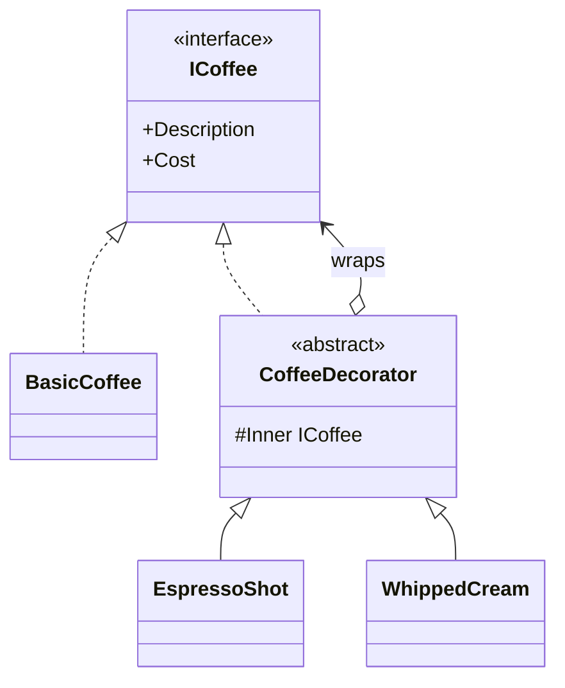

## Story: the café and the combinatorial explosion

Imagine you own a café. Customers order a coffee and then customize it - an extra espresso shot, milk, syrup, whipped cream - in any combination, and you have to describe and price each order correctly.

The naive approach is a class per combination:

```csharp
public sealed class Coffee { /* base */ }
public sealed class CoffeeWithEspressoShot { /* ... */ }
public sealed class CoffeeWithWhippedCream { /* ... */ }
public sealed class CoffeeWithEspressoShotAndWhippedCream { /* ... */ }
// ...and one more class for every new add-on or combination
```

Three add-ons already mean eight combinations; add one more and you double again. This is the textbook symptom that calls for the **Decorator pattern**: instead of a class per combination, you start with a base object and *wrap* it in one decorator per customization, stacking them at runtime.

## Building it step by step

**Step 1 - the component interface.** Everything (the base and every decorator) shares it:

```csharp
public interface ICoffee
{
    string Description { get; }
    decimal Cost { get; }
}
```

**Step 2 - the concrete component**, a plain coffee:

```csharp
public sealed class BasicCoffee : ICoffee
{
    public string Description => "Coffee";
    public decimal Cost => 2.00m;
}
```

**Step 3 - the abstract decorator.** It implements `ICoffee` *and* holds an inner `ICoffee` (composition). This base is what makes decorators stackable on a component **or another decorator**:

```csharp
public abstract class CoffeeDecorator(ICoffee inner) : ICoffee
{
    protected ICoffee Inner { get; } = inner;

    public abstract string Description { get; }
    public abstract decimal Cost { get; }
}
```

**Step 4 - concrete decorators.** Each adds exactly one customization and delegates the rest to `Inner`:

```csharp
public sealed class EspressoShot(ICoffee inner) : CoffeeDecorator(inner)
{
    public override string Description => $"{Inner.Description}, +espresso";
    public override decimal Cost => Inner.Cost + 0.80m;
}

public sealed class Milk(ICoffee inner) : CoffeeDecorator(inner)
{
    public override string Description => $"{Inner.Description}, +milk";
    public override decimal Cost => Inner.Cost + 0.40m;
}

public sealed class WhippedCream(ICoffee inner) : CoffeeDecorator(inner)
{
    public override string Description => $"{Inner.Description}, +whipped cream";
    public override decimal Cost => Inner.Cost + 0.60m;
}
```

**Putting it together** - build any drink by stacking, no combinatorial classes:

```csharp
ICoffee order = new WhippedCream(new EspressoShot(new BasicCoffee()));

Console.WriteLine(order.Description); // Coffee, +espresso, +whipped cream
Console.WriteLine(order.Cost);        // 3.40
```

## Definition

> The **Decorator** is a structural pattern that attaches new responsibilities to an object dynamically and transparently, by wrapping it in another object of the same type. It's a flexible alternative to subclassing for extending behavior.



The four roles: **Component** (`ICoffee`), **Concrete Component** (`BasicCoffee`), **Decorator** (`CoffeeDecorator`, holds a reference to a Component), **Concrete Decorators** (`EspressoShot`, `Milk`, `WhippedCream`).

## Composing decorators for real: cross-cutting concerns

Coffee teaches the *shape*. In production, the decorators you actually write wrap a *service* with cross-cutting concerns - and real systems need several, applied in a deliberate order:

1. **Caching** to avoid unnecessary remote calls,
2. **Logging** to track operations,
3. **Retry** to survive transient faults.

Here's a detail that matters and that most articles get wrong: **the concerns you stack have to match the failure modes of the thing underneath.** Retry only makes sense if the inner call actually throws *transient* faults. So let's make the inner service something that genuinely has them - a client that reads product data from a remote catalog API over HTTP:

```csharp
public interface IProductService
{
    Task<Product?> GetProductAsync(int id, CancellationToken ct = default);
}

// The real call goes over the network - so it can fail transiently (timeouts, 503s).
public sealed class HttpProductService(HttpClient http) : IProductService
{
    public async Task<Product?> GetProductAsync(int id, CancellationToken ct = default)
    {
        using var response = await http.GetAsync($"/products/{id}", ct);

        if (response.StatusCode == HttpStatusCode.NotFound)
            return null;

        response.EnsureSuccessStatusCode(); // throws HttpRequestException on a transient 5xx
        return await response.Content.ReadFromJsonAsync<Product>(ct);
    }
}
```

> **Why not an EF Core / database service here?** Because a database call throws `DbUpdateException`, `SqlException`, or `TimeoutException` - *not* `HttpRequestException`. If you wrap an EF Core service in a retry decorator that handles `HttpRequestException`, the retry **never fires**, because the inner call never throws that type. Match the resilience policy to the real exceptions of the inner call. For a DB-backed service you'd handle `SqlException`/`DbUpdateException` (and lean on EF Core's built-in `EnableRetryOnFailure` execution strategy instead). We use HTTP precisely so the `HttpRequestException` retry below is *correct*.

Each concern becomes its own decorator implementing the same `IProductService`. **Caching** short-circuits the chain on a hit:

```csharp
public sealed class CachingProductService(
    IProductService inner,
    IMemoryCache cache) : IProductService
{
    public async Task<Product?> GetProductAsync(int id, CancellationToken ct = default)
    {
        if (cache.TryGetValue($"product:{id}", out Product? cached))
            return cached;

        var product = await inner.GetProductAsync(id, ct);

        // Cache hits AND misses, but give "not found" a much shorter TTL so a product
        // that gets created moments later isn't masked as missing for the full window.
        cache.Set(
            $"product:{id}",
            product,
            product is null ? TimeSpan.FromSeconds(10) : TimeSpan.FromMinutes(5));

        return product;
    }
}
```

> **Two production traps in five lines of cache code.**
> 1. **Caching `null` (negative caching).** The naive `GetOrCreate` that caches whatever the inner call returns will happily cache "not found" for the full TTL - so a product created seconds later looks missing for five minutes. Give misses a short TTL (above), or don't cache them at all.
> 2. **Cache stampede.** Under load, many concurrent requests for the same cold key all miss, all hit the origin, and all recompute together. `IMemoryCache` doesn't prevent this. In .NET 9+, prefer **`HybridCache`**, which has built-in stampede protection (request coalescing) and an L1+L2 (in-memory + distributed) model - it's the modern default for exactly this decorator.

**Logging** records the call and timing, then delegates:

```csharp
public sealed class LoggingProductService(
    IProductService inner,
    ILogger<LoggingProductService> logger) : IProductService
{
    public async Task<Product?> GetProductAsync(int id, CancellationToken ct = default)
    {
        var start = Stopwatch.GetTimestamp();
        var product = await inner.GetProductAsync(id, ct);
        logger.LogInformation("GetProduct({Id}) took {Ms}ms (found={Found})",
            id, Stopwatch.GetElapsedTime(start).TotalMilliseconds, product is not null);
        return product;
    }
}
```

**Retry** uses [Polly v8](https://www.pollydocs.org/) to survive transient failures of the underlying HTTP call - and now `HttpRequestException` is exactly the right type to handle:

```csharp
public sealed class ResilientProductService : IProductService
{
    private readonly IProductService _inner;
    private readonly ResiliencePipeline _pipeline;

    public ResilientProductService(IProductService inner)
    {
        _inner = inner;
        _pipeline = new ResiliencePipelineBuilder()
            .AddRetry(new RetryStrategyOptions
            {
                // These are the faults HttpProductService actually throws.
                ShouldHandle = new PredicateBuilder()
                    .Handle<HttpRequestException>()
                    .Handle<TimeoutRejectedException>(),
                MaxRetryAttempts = 3,
                BackoffType = DelayBackoffType.Exponential,
                UseJitter = true,                       // spread retries to avoid a thundering herd
                Delay = TimeSpan.FromMilliseconds(200),
            })
            .Build();
    }

    public Task<Product?> GetProductAsync(int id, CancellationToken ct = default) =>
        _pipeline.ExecuteAsync(async token => await _inner.GetProductAsync(id, token), ct).AsTask();
}
```

## Adding Scrutor - composing the onion in DI

Hand-nesting `new Caching(new Logging(new Resilient(new HttpProductService(http))))` is fine to *understand* the order; in a real app you let the container build it. [Scrutor](https://github.com/khellang/Scrutor) adds `Decorate<,>()` to `IServiceCollection`:

```csharp
builder.Services.AddMemoryCache();
builder.Services.AddHttpClient<IProductService, HttpProductService>(c =>
    c.BaseAddress = new Uri("https://catalog.internal"));

builder.Services.Decorate<IProductService, ResilientProductService>(); // innermost wrapper
builder.Services.Decorate<IProductService, LoggingProductService>();
builder.Services.Decorate<IProductService, CachingProductService>();   // outermost wrapper
```

Resolved chain: `Caching → Logging → Resilient → HttpProductService`. **The last `Decorate` call is the outermost layer**, and order is a real decision: caching is outermost so a cache hit never logs or retries; resilience sits closest to the actual call so only real network failures trigger retries. Consumers still inject a plain `IProductService` and never know there's a four-layer onion behind it.

> **The trade-off hiding in "caching outermost".** Putting caching on the outside means a cache *hit* never reaches the logging decorator - so your logs (and timing metrics) only ever show *misses*. That's usually what you want (you don't want a log line per hit), but it means "GetProduct latency" in your logs is the *slow* path only. If you need hit/miss observability, add a tiny metric **inside** the caching decorator (increment a `cache_hit`/`cache_miss` counter) rather than moving logging outward. Order is a design choice with consequences, not a free win.

### A fifth layer you'll actually want: metrics / tracing

In production the most valuable decorator is often observability - an `Activity` (OpenTelemetry span) and a duration histogram around the call:

```csharp
public sealed class TracingProductService(
    IProductService inner,
    Meter meter) : IProductService
{
    private static readonly ActivitySource Source = new("Catalog.ProductService");
    private readonly Histogram<double> _duration =
        meter.CreateHistogram<double>("product.get.duration", "ms");

    public async Task<Product?> GetProductAsync(int id, CancellationToken ct = default)
    {
        using var activity = Source.StartActivity("GetProduct");
        activity?.SetTag("product.id", id);

        var start = Stopwatch.GetTimestamp();
        try
        {
            return await inner.GetProductAsync(id, ct);
        }
        finally
        {
            _duration.Record(Stopwatch.GetElapsedTime(start).TotalMilliseconds);
        }
    }
}
```

It's the same shape - one responsibility, faithful delegation - and it slots into the onion with one more `Decorate<,>()` call.

## The lifetime trap: captive dependencies

This is the bug that turns a clean decorator stack into a heisenbug, and almost no tutorial mentions it. A decorator's lifetime is governed by how the *whole chain* is registered. If you register the chain as a **singleton** but one decorator depends on a **scoped** service (say a scoped `IProductService` that holds a `DbContext`), the singleton captures the first scope's instance and reuses it forever - a *captive dependency*, and a source of cross-request data bleed and `ObjectDisposedException`s.

Rules that keep you safe:

- Register the entire decorated chain at **one** lifetime, and make it the *shortest* lifetime any layer needs. If `HttpProductService` is scoped (typed `HttpClient` is), keep the decorators scoped.
- `IMemoryCache`/`HybridCache` are singletons by design - that's fine, because the *caching decorator* holds a reference to the singleton cache, it doesn't *become* a singleton itself.
- If a decorator implements `IDisposable`/`IAsyncDisposable`, the container disposes it with the scope - don't dispose `Inner` yourself unless you own its lifetime.

## Testing a decorator in isolation

A decorator's contract is "add my one behavior, then faithfully delegate." That's directly testable with a fake inner:

```csharp
[Fact]
public async Task Caching_decorator_calls_inner_once_for_two_reads_of_the_same_id()
{
    var inner = new CountingProductService(returns: new Product(Id: 7));
    var sut = new CachingProductService(inner, new MemoryCache(new MemoryCacheOptions()));

    var first  = await sut.GetProductAsync(7);
    var second = await sut.GetProductAsync(7);

    Assert.Same(first, second);
    Assert.Equal(1, inner.CallCount); // second read was served from cache - delegation happened once
}
```

The same approach proves logging emits, retry re-invokes on a transient fault, and tracing starts a span - each decorator tested alone, no onion required.

## Pros & cons

**Pros**
- Adds behavior **without modifying** the component (Open/Closed) and without subclass explosion.
- Each concern is a single-responsibility class you can unit-test in isolation.
- Behaviors compose in any order you choose, and composition lives at the DI edge.

**Cons**
- Order matters and isn't visible at the call site - document the intended stack.
- A deep onion complicates stack traces and debugging.
- Every decorator must faithfully delegate the whole interface; wide interfaces mean lots of pass-through.
- Lifetime mismatches across the chain cause captive-dependency bugs - register the whole stack at one lifetime.

## Where to use / NOT to use

**Use it when** you layer cross-cutting concerns (caching, logging, metrics, resilience, authorization) over a service - especially behind DI - and you don't want to touch the underlying type.

**Avoid it when:**
- You own the class and the behavior genuinely belongs to it - just add it.
- The interface is huge - every decorator becomes mostly delegation boilerplate (split the interface first).
- You need to change the *contract* (different parameters/return type) - that's an **Adapter**, not a Decorator.
- A framework pipeline already models the concern better for that layer (ASP.NET middleware, MediatR behaviors).

## Key takeaways

1. Decorator replaces "a class per combination" with "one wrapper per behavior, stacked at runtime".
2. The shape is four roles: Component, Concrete Component, Decorator (holds the inner), Concrete Decorators.
3. In production the decorators are cross-cutting concerns - caching, logging, resilience, tracing.
4. **Match the resilience policy to the inner call's real exceptions** - retry `HttpRequestException` for HTTP, DB exceptions for a database, never the wrong one.
5. Cache misses *and* "not found" deliberately; reach for **`HybridCache`** (.NET 9+) to get stampede protection for free.
6. Use **Scrutor's `Decorate<,>()`** to build the onion in DI; the last call is the outermost layer.
7. Put **caching outermost** and **resilience innermost** - and know the trade-off (outermost caching hides hits from your logs).
8. Register the whole chain at **one lifetime** to avoid captive dependencies.
