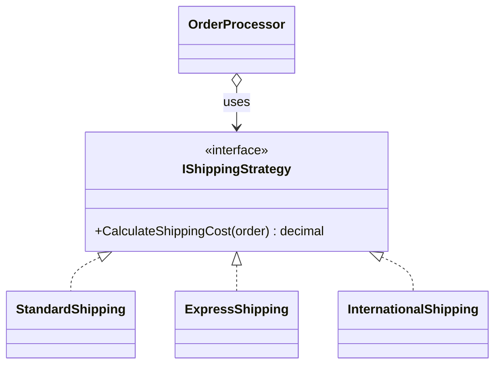

## Story: BookLibrary's shipping problem

You run an online bookstore, **BookLibrary**. You offer several shipping methods - standard, express, and a special international option with customs handling. Early on the cost was easy, so someone hardcoded it:

```csharp
public decimal CalculateShipping(Order order, ShippingOption option)
{
    if (option == ShippingOption.Standard)
        return 5.00m + 0.50m * order.TotalWeightKg;
    else if (option == ShippingOption.Express)
        return 15.00m + 1.20m * order.TotalWeightKg;
    else if (option == ShippingOption.International)
        return 25.00m + 3.00m * order.TotalWeightKg + order.CustomsFee;
    // ...a new branch for every new option, re-tested every time
    else
        throw new NotSupportedException();
}
```

Every new option means editing this method and re-testing all the others. It's a wall of `if-else` that's hard to maintain and impossible to scale - and the same shape shows up everywhere: payment gateways, discount rules, export formats. You need to "plug in" the right algorithm at runtime without rewriting the core.

## The solution: a family of interchangeable algorithms

**Step 1 - the strategy interface.** One operation, one contract:

```csharp
public interface IShippingStrategy
{
    decimal CalculateShippingCost(Order order);
}
```

**Step 2 - one class per algorithm.** Each owns its own rules and is independently testable:

```csharp
public sealed class StandardShipping : IShippingStrategy
{
    public decimal CalculateShippingCost(Order order) =>
        5.00m + 0.50m * order.TotalWeightKg;
}

public sealed class ExpressShipping : IShippingStrategy
{
    public decimal CalculateShippingCost(Order order) =>
        15.00m + 1.20m * order.TotalWeightKg;
}

public sealed class InternationalShipping : IShippingStrategy
{
    public decimal CalculateShippingCost(Order order) =>
        25.00m + 3.00m * order.TotalWeightKg + order.CustomsFee;
}
```

**Step 3 - the context.** `OrderProcessor` holds a strategy and doesn't know or care which one it is:

```csharp
public sealed class OrderProcessor(IShippingStrategy shipping)
{
    public decimal GetShippingCost(Order order) => shipping.CalculateShippingCost(order);
}
```

Adding a new option is now *adding a class*, not editing a method. The wall of `if-else` is gone, and `OrderProcessor` never changes again - that's the Open/Closed Principle in practice.

> **Is the shipping example a bit "textbook"?** A little - the algorithms differ only by constants. That's intentional for learning the shape. The pattern earns its keep when the strategies are *genuinely* different, which is exactly the payment-gateway case we build below: different SDKs, different dependencies, different failure modes. Read the shipping version for the shape, the payment version for the reality.

## Definition

> The **Strategy** pattern defines a family of algorithms, encapsulates each in its own class, and makes them interchangeable at runtime - decoupling the algorithm from the client that uses it.



## Strategy vs. polymorphism on the domain model

Before wiring anything, kill a common confusion. Strategy is *not* the same as putting a `virtual` method on your domain type. Use Strategy when the **algorithm** varies independently of the data; use plain polymorphism when the **behavior belongs to the object**.

```csharp
// NOT Strategy - this behavior is intrinsic to the shape; it belongs on the type.
public abstract class Shape { public abstract double Area(); }
public sealed class Circle(double r) : Shape { public override double Area() => Math.PI * r * r; }

// Strategy - shipping cost is a policy *about* an order, not a property *of* it.
// The same Order can be quoted under Standard, Express, or a Q4 promo without changing.
public interface IShippingStrategy { decimal CalculateShippingCost(Order order); }
```

The tell: if you'd ever want to run the *same* object through a *different* algorithm (re-quote an order, re-price a basket, export the same report two ways), it's Strategy. If the object always behaves the one way that matches what it *is*, it's polymorphism - don't reach for Strategy.

## Dependency Injection with Strategy (.NET 8 keyed services)

In older code you picked the strategy with a `switch`. Since .NET 8 the container does it natively with **keyed services** - register each strategy under a key, then resolve the one you need:

```csharp
// Stateless strategies (no per-request dependencies) → register as singletons.
builder.Services.AddKeyedSingleton<IShippingStrategy, StandardShipping>(ShippingOption.Standard);
builder.Services.AddKeyedSingleton<IShippingStrategy, ExpressShipping>(ShippingOption.Express);
builder.Services.AddKeyedSingleton<IShippingStrategy, InternationalShipping>(ShippingOption.International);
```

> **Lifetime is a real decision, not a default.** The three shipping strategies are pure functions - no fields, no dependencies - so `Singleton` is correct and avoids per-request allocation. But the moment a strategy depends on something *scoped* (a `DbContext`, a per-request tenant), it must be `Scoped`, and a singleton context that holds it would be a **captive dependency** (the classic "why is my DbContext disposed?" bug). Rule: a strategy's lifetime must be ≤ the lifetime of everything it depends on.

When the key is fixed at the call site, inject it directly with `[FromKeyedServices]` - no `switch`, no factory:

```csharp
app.MapPost("/orders/{id}/ship/express", (
    int id,
    [FromKeyedServices(ShippingOption.Express)] IShippingStrategy strategy,
    Order order) => Results.Ok(strategy.CalculateShippingCost(order)));
```

## Combining Strategy with a Factory

Usually the choice is **dynamic** - it comes from the order. A small factory resolves the right strategy by key and keeps callers decoupled from the container:

```csharp
public interface IShippingStrategyFactory
{
    IShippingStrategy For(ShippingOption option);
}

public sealed class ShippingStrategyFactory(IServiceProvider provider) : IShippingStrategyFactory
{
    public IShippingStrategy For(ShippingOption option) =>
        // GetRequiredKeyedService throws a clear exception itself if the key is unregistered -
        // no need for the GetKeyedService(...) ?? throw dance.
        provider.GetRequiredKeyedService<IShippingStrategy>(option);
}
```

```csharp
public sealed class CheckoutService(IShippingStrategyFactory factory)
{
    public decimal Quote(Order order) =>
        factory.For(order.ShippingOption).CalculateShippingCost(order);
}
```

`CheckoutService` has zero knowledge of which strategies exist. Add `DroneShipping`, register it under a key, and checkout keeps working untouched.

> **Performance:** keyed resolution is a dictionary lookup - effectively the same cost as the `switch` it replaces, with none of the maintenance. You're not trading speed for cleanliness here; you're getting both.

> Pre-.NET-8 alternative still worth knowing: inject `IEnumerable<IShippingStrategy>` plus a `Key` property on each, and select with `strategies.Single(s => s.Key == option)`. It works on any version and is ideal when you need *all* strategies at once.

## The real-world case: payment gateways

Shipping strategies differ by constants. **Payment** strategies differ by *everything* - separate SDKs, separate credentials, separate failure modes - which is where Strategy stops being academic:

```csharp
public interface IPaymentStrategy
{
    Task<PaymentResult> ChargeAsync(Money amount, PaymentDetails details, CancellationToken ct);
}

public sealed class StripePayment(IStripeClient stripe) : IPaymentStrategy
{
    public async Task<PaymentResult> ChargeAsync(Money amount, PaymentDetails details, CancellationToken ct)
    {
        var intent = await stripe.PaymentIntents.CreateAsync(/* ... */, ct);
        return PaymentResult.From(intent);
    }
}

public sealed class PayPalPayment(IPayPalClient paypal) : IPaymentStrategy { /* totally different SDK */ }
public sealed class CryptoPayment(ICoinGateway gateway)  : IPaymentStrategy { /* totally different again */ }
```

```csharp
builder.Services.AddKeyedScoped<IPaymentStrategy, StripePayment>(PaymentMethod.Card);
builder.Services.AddKeyedScoped<IPaymentStrategy, PayPalPayment>(PaymentMethod.PayPal);
builder.Services.AddKeyedScoped<IPaymentStrategy, CryptoPayment>(PaymentMethod.Crypto);
```

Note these are `Scoped`, not `Singleton` - each holds an injected SDK client whose lifetime the container manages per request. Same pattern, different lifetime, *because the dependencies differ*. That's the judgement keyed DI lets you express cleanly.

## Composing Strategy with Decorator

Strategy and Decorator stack beautifully: decorate *the interface*, and every strategy transparently gains the cross-cutting concern. Wrap each payment strategy with a logging/metrics decorator and you instrument all of them in one place:

```csharp
// Each keyed payment strategy gets wrapped with the same logging behavior.
builder.Services.Decorate<IPaymentStrategy, LoggingPaymentStrategy>();
```

The selection (Strategy) and the cross-cutting behavior (Decorator) are orthogonal - you change which algorithm runs without touching the instrumentation, and vice versa. (See the Decorator chapter for the onion mechanics.)

## Configuration-driven selection

Sometimes the default algorithm is an environment decision - "international orders default to express in Q4". Drive it from configuration with the Options pattern:

```json
// appsettings.json
{ "Shipping": { "DefaultOption": "Standard" } }
```

```csharp
public sealed class ShippingOptions
{
    public ShippingOption DefaultOption { get; init; } = ShippingOption.Standard;
}

builder.Services.Configure<ShippingOptions>(builder.Configuration.GetSection("Shipping"));
```

```csharp
public sealed class DefaultShippingService(
    IShippingStrategyFactory factory,
    IOptions<ShippingOptions> options)
{
    public decimal Quote(Order order) =>
        factory.For(options.Value.DefaultOption).CalculateShippingCost(order);
}
```

Now ops change the active algorithm by editing config - no recompile. Together the techniques give you: strategies registered by key, a factory for dynamic resolution, and configuration for defaults.

## Testing: prove the right strategy is chosen

Two things are worth testing - each strategy's math (trivial, in isolation), and that the *context* selects correctly. The second is the one people skip; with the factory it's a three-line test:

```csharp
[Fact]
public void CheckoutService_uses_the_strategy_matching_the_orders_option()
{
    var express = new ExpressShipping();
    var factory = Substitute.For<IShippingStrategyFactory>();   // NSubstitute
    factory.For(ShippingOption.Express).Returns(express);

    var order = new Order { ShippingOption = ShippingOption.Express, TotalWeightKg = 2 };
    var quote = new CheckoutService(factory).Quote(order);

    Assert.Equal(express.CalculateShippingCost(order), quote);
    factory.Received(1).For(ShippingOption.Express);
}
```

Each strategy class gets its own pure unit test (no DI, no mocks) - that's the whole point of pulling the branches out into classes.

## Pros & cons

**Pros**
- Replaces sprawling conditionals with small, single-responsibility classes.
- New algorithms are *added*, not edited in - Open/Closed by construction.
- Each strategy is trivially unit-testable and carries only its own dependencies.
- Selection can be static (keyed DI), dynamic (factory), or config-driven; lifetime is per-strategy.

**Cons**
- More types - overkill for two stable branches that never change.
- Someone still has to choose; you've moved the decision into a factory/config, not erased it.
- Strategies that share a lot of logic can drift - extract the shared part (a base class or a shared helper).

## Where to use / NOT to use

**Use it when** you have multiple interchangeable ways to do one job (shipping, payment, pricing, discounts, export formats), the set grows over time, or the choice is made at runtime/config.

**Avoid it when:**
- There are only two branches that will never grow - a simple `if` is more honest than three files.
- The "strategies" don't share a stable interface - forcing them under one creates a leaky abstraction.
- The branching is on *data shape*, not *behavior* - that's polymorphism on the domain model, not Strategy.

## Key takeaways

1. Strategy turns `switch`-on-behavior into a family of swappable classes behind one interface.
2. The context (`OrderProcessor`) depends on the interface and never changes when you add algorithms.
3. In .NET 8+, register strategies with **keyed DI** - `Singleton` for stateless, `Scoped` when they hold scoped deps.
4. When the key is dynamic, resolve through a small **factory** using `GetRequiredKeyedService`.
5. Strategy ≠ domain polymorphism; combine Strategy with **Decorator** for cross-cutting concerns; drive defaults from **configuration**.
