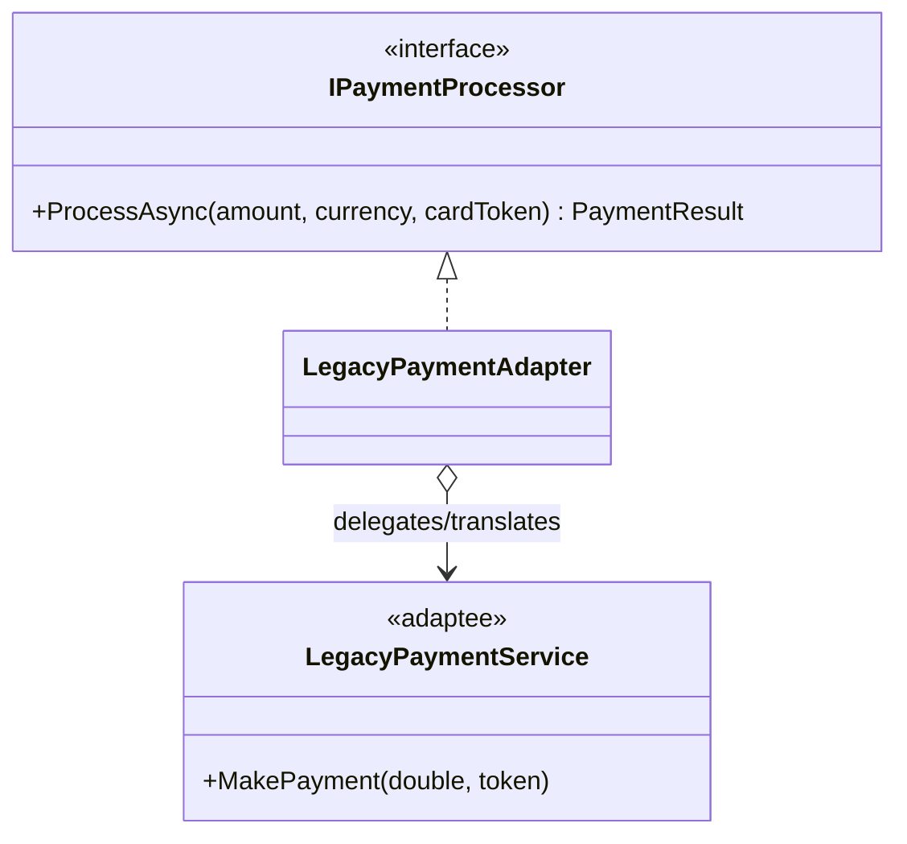

## The problem: the plug that doesn't fit

You move to a new country, go to plug in your laptop, and the prongs don't match the socket. You don't rewire the building and you don't buy a new laptop - you buy a **power adapter**. It sits between two incompatible interfaces and translates one into the other, changing neither side.

Software is full of sockets that don't fit. You're building a modern app that talks REST and `async`, and you must integrate a **legacy payment gateway** that's synchronous, uses `double` for money, and has a completely different method shape. Rewriting the legacy system is risky and expensive; rewriting your app to match it is worse. The **Adapter pattern** is the travel adapter: a class that implements *your* interface and translates calls to the foreign one.

## The interface your domain wants - and the file-storage abstraction we'll reuse

We'll meet two adaptees in this chapter, so let's define both target interfaces up front (the second one, `IFileStorage`, is referenced by the class adapter *and* the cloud section later):

```csharp
public sealed record PaymentResult(bool Success, string TransactionId);

public interface IPaymentProcessor
{
    // Note: cardToken is per-transaction data, so it belongs on the method, not the constructor.
    Task<PaymentResult> ProcessAsync(
        decimal amount, string currency, string cardToken, CancellationToken ct = default);
}

public interface IFileStorage
{
    Task SaveAsync(string key, Stream content, CancellationToken ct = default);
    Task<Stream> ReadAsync(string key, CancellationToken ct = default);
}
```

## The teaching example: adapting a legacy payment gateway

**What the vendor gives you** - incompatible in almost every way (synchronous, `double`, USD-only, different result type, and it throws its own exception type). You can't change it:

```csharp
public sealed class LegacyResult
{
    public bool IsApproved { get; init; }
    public string? AuthCode { get; init; }
}

public sealed class LegacyGatewayException(string reason) : Exception(reason);

public sealed class LegacyPaymentService
{
    public LegacyResult MakePayment(double amountInDollars, string cardToken) =>
        // ...old SOAP/SDK call we are not allowed to touch; may throw LegacyGatewayException...
        new LegacyResult { IsApproved = true, AuthCode = Guid.NewGuid().ToString("N") };
}
```

**The adapter** implements `IPaymentProcessor` and does the translation the rest of your app must never see - async↔sync, `decimal`↔`double`, a currency guard, result mapping, **and exception translation** so the vendor's exception type never leaks into your domain:

```csharp
public sealed class LegacyPaymentAdapter(LegacyPaymentService legacy) : IPaymentProcessor
{
    public Task<PaymentResult> ProcessAsync(
        decimal amount, string currency, string cardToken, CancellationToken ct = default)
    {
        if (!string.Equals(currency, "USD", StringComparison.OrdinalIgnoreCase))
            throw new NotSupportedException("The legacy gateway only supports USD.");

        try
        {
            LegacyResult result = legacy.MakePayment((double)amount, cardToken);
            return Task.FromResult(
                new PaymentResult(result.IsApproved, result.AuthCode ?? string.Empty));
        }
        catch (LegacyGatewayException ex)
        {
            // Translate the foreign exception into YOUR domain's vocabulary.
            throw new PaymentFailedException("The payment gateway rejected the request.", ex);
        }
    }
}
```

> **Why `cardToken` moved to the method.** In a first draft it's tempting to pass `cardToken` into the adapter's constructor. Don't: the token is *per-transaction*, so a constructor token forces a new adapter instance per payment and makes the adapter impossible to register as a normal DI service (singleton/scoped). Per-call data goes on the method; per-adapter configuration (endpoints, credentials objects) goes on the constructor. This one distinction is the difference between an adapter you can inject once and one you keep `new`-ing up.

> **Error translation is half the job.** An adapter that converts types but lets `LegacyGatewayException`, `AmazonS3Exception`, or `SqlException` bubble through has failed - now your domain code has a `catch` for a vendor type, and you've leaked the very dependency you were quarantining. Map foreign failures to your own (`PaymentFailedException`, `StorageException`) at the adapter boundary.

Your application depends only on `IPaymentProcessor`, injected once:

```csharp
IPaymentProcessor processor = new LegacyPaymentAdapter(new LegacyPaymentService());
PaymentResult result = await processor.ProcessAsync(49.99m, "USD", cardToken);
```

## Definition

> The **Adapter** is a structural pattern that converts the interface of a class into another interface clients expect, letting otherwise-incompatible types collaborate through a translating wrapper - without changing either side.



## Object Adapter (composition)

The adapter above is an **object adapter**: it *holds* the adaptee and delegates to it. This is the idiomatic C# form - it works with sealed SDK types, can adapt several collaborators at once, and stays free of inheritance constraints. **Prefer this in almost all cases.**

## Class Adapter (inheritance)

A **class adapter** instead *inherits* from the adaptee and implements your interface, so it both *is* the adaptee and satisfies your contract. C# has single inheritance, so this only works when the adaptee is an unsealed class you may extend:

```csharp
public class VendorBlobClient
{
    public virtual Task UploadAsync(string path, Stream data) => /* ... */;
    public virtual Task<Stream> DownloadAsync(string path) => /* ... */;
}

// Class adapter: IS a VendorBlobClient AND satisfies IFileStorage.
public sealed class VendorBlobAdapter : VendorBlobClient, IFileStorage
{
    public Task SaveAsync(string key, Stream content, CancellationToken ct = default) =>
        UploadAsync(key, content);                  // reuse the inherited member

    public async Task<Stream> ReadAsync(string key, CancellationToken ct = default) =>
        await DownloadAsync(key);
}
```

Reach for the class adapter only when you specifically want to **override and reuse** the base's behavior. It couples you to a concrete base and breaks the moment the SDK type is `sealed` - which most modern SDK clients are.

## Cloud providers integration

The highest-value use: make your app cloud-agnostic. We already defined `IFileStorage`; now write one adapter per provider - both implement it:

```csharp
public sealed class S3StorageAdapter(IAmazonS3 s3, string bucket) : IFileStorage
{
    public async Task SaveAsync(string key, Stream content, CancellationToken ct = default)
    {
        try
        {
            await s3.PutObjectAsync(new PutObjectRequest
            {
                BucketName = bucket, Key = key, InputStream = content
            }, ct);
        }
        catch (AmazonS3Exception ex)
        {
            throw new StorageException($"Failed to save '{key}'.", ex); // translate, don't leak
        }
    }

    // The caller OWNS the returned stream and must dispose it. The underlying
    // GetObjectResponse is disposed when its ResponseStream is disposed, so handing
    // back ResponseStream transfers ownership cleanly - document this on IFileStorage.
    public async Task<Stream> ReadAsync(string key, CancellationToken ct = default)
    {
        var response = await s3.GetObjectAsync(bucket, key, ct);
        return response.ResponseStream;
    }
}

public sealed class AzureBlobStorageAdapter(BlobContainerClient container) : IFileStorage
{
    public async Task SaveAsync(string key, Stream content, CancellationToken ct = default) =>
        await container.UploadBlobAsync(key, content, ct);

    public async Task<Stream> ReadAsync(string key, CancellationToken ct = default) =>
        (await container.GetBlobClient(key).DownloadStreamingAsync(cancellationToken: ct))
            .Value.Content;
}
```

> **Stream ownership is a contract, not a detail.** `ReadAsync` returns a `Stream` the *caller* must dispose, and the implementation must not dispose it first. Write that rule into the `IFileStorage` XML doc comment - "the returned stream is owned by the caller" - or you'll get either `ObjectDisposedException`s (disposed too early) or socket leaks (never disposed). Ownership ambiguity is the most common bug in storage adapters.

Pick the provider once, from configuration - the only spot that knows which cloud you're on:

```csharp
builder.Services.AddSingleton<IFileStorage>(sp =>
{
    var cfg = sp.GetRequiredService<IConfiguration>();
    return cfg["Storage:Provider"] switch
    {
        "Azure" => new AzureBlobStorageAdapter(sp.GetRequiredService<BlobContainerClient>()),
        "S3"    => new S3StorageAdapter(sp.GetRequiredService<IAmazonS3>(), cfg["Storage:Bucket"]!),
        var x   => throw new NotSupportedException($"Unknown storage provider '{x}'.")
    };
});
```

> **Lifetime & thread safety.** The cloud SDK clients (`IAmazonS3`, `BlobContainerClient`) are designed to be **thread-safe singletons** - register them once and let every request share them; creating one per call leaks connections and kills throughput. The adapters above are stateless wrappers, so registering `IFileStorage` as a singleton is correct here. (Contrast with a scoped adaptee like a `DbContext`, where the adapter must be scoped too - see the captive-dependency note in the Decorator chapter.)

Every service injects `IFileStorage`. Adding Google Cloud Storage is *one new adapter and one config value* - domain code never changes and stays testable against a fake.

> Notice patterns composing: that provider `switch` is selection (**Strategy**) and each branch builds an **Adapter**. Adapter quarantines the foreign API; Strategy picks which quarantined thing to use.

## The honest limit: adapters that *lie*

An adapter can hide a mismatch so well that it papers over a capability the provider genuinely lacks - and that's dangerous. Example: your `IFileStorage` grows a `MoveAsync(from, to)`. Azure Blob has a native move-ish operation; **S3 has no atomic move**. The S3 adapter must fake it:

```csharp
public async Task MoveAsync(string from, string to, CancellationToken ct = default)
{
    await s3.CopyObjectAsync(bucket, from, bucket, to, ct);  // step 1
    await s3.DeleteObjectAsync(bucket, from, ct);            // step 2 - NOT atomic with step 1
}
```

If the process dies between the two calls, you have the object under *both* keys. The adapter compiles and looks symmetric with Azure, but the guarantee differs. The senior move is to **not pretend**: either keep `IFileStorage` to operations every provider supports atomically, or document the move as "copy-then-delete, non-atomic on S3" so callers can compensate. An adapter's job is to translate, not to invent guarantees the adaptee can't keep.

## Testing an adapter

You test an adapter by faking the adaptee and asserting the translation - types, units, currency guard, and error mapping:

```csharp
[Fact]
public async Task LegacyAdapter_translates_decimal_to_double_and_maps_the_auth_code()
{
    var legacy = Substitute.For<LegacyPaymentService>();
    legacy.MakePayment(49.99d, "tok_123")
          .Returns(new LegacyResult { IsApproved = true, AuthCode = "AUTH9" });

    var sut = new LegacyPaymentAdapter(legacy);
    var result = await sut.ProcessAsync(49.99m, "USD", "tok_123");

    Assert.True(result.Success);
    Assert.Equal("AUTH9", result.TransactionId);
    legacy.Received(1).MakePayment(49.99d, "tok_123"); // proves decimal→double translation
}

[Fact]
public async Task LegacyAdapter_translates_vendor_exception_into_domain_exception()
{
    var legacy = Substitute.For<LegacyPaymentService>();
    legacy.MakePayment(default, default!).ReturnsForAnyArgs(_ => throw new LegacyGatewayException("declined"));

    var sut = new LegacyPaymentAdapter(legacy);

    await Assert.ThrowsAsync<PaymentFailedException>(
        () => sut.ProcessAsync(10m, "USD", "tok"));
}
```

## Pros & cons

**Pros**
- Keeps legacy and third-party types out of your domain - they live only inside adapters.
- Makes vendors swappable and your core code testable against your own interface.
- Single Responsibility: all translation - types, units, async, **errors** - lives in one place.
- Lets you adopt a new SDK by writing an adapter, not a migration.

**Cons**
- One more layer of indirection and types to maintain.
- A target interface that leaks vendor concepts defeats the purpose - design it from your domain.
- Adapting a badly-mismatched API can hide real impedance (e.g. faking a non-atomic operation a provider can't do natively).

## Where to use / NOT to use

**Use it when** you integrate a legacy system, a third-party SDK, or several providers of the same capability, and you want your app to depend on an interface *you* control.

**Avoid it when:**
- You control both sides - just change the interface instead of wrapping it.
- The wrapper only renames methods 1:1 with no real translation or swappability - that's ceremony.
- You're *preserving* the interface and *adding behavior* - that's a **Decorator**, not an Adapter.

## Key takeaways

1. Design the interface your domain wants first; adapt the vendor to it, never the reverse.
2. The adapter translates everything the rest of your app shouldn't see - sync/async, types, **errors**, units.
3. Per-transaction data goes on the **method**; per-adapter config goes on the **constructor** (so the adapter is injectable).
4. Prefer the **object adapter** (composition); use the **class adapter** only to reuse an unsealed base.
5. Make stream/resource ownership an explicit contract; map foreign exceptions to your own.
6. Cloud SDK clients are thread-safe singletons - register them once; one adapter per provider behind one interface makes clouds swappable from config.
7. Don't let an adapter *lie* about guarantees the adaptee can't keep (S3 has no atomic move).
8. Same interface + new behavior → Decorator. Different interface → Adapter.
