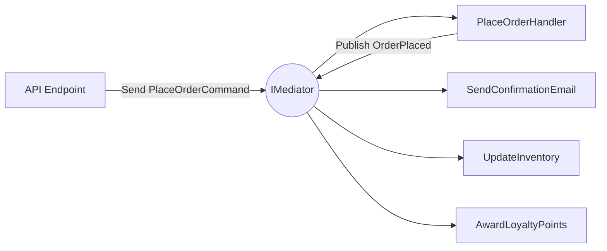

## The story: the overwhelmed airport

Picture an airport where every pilot talks directly to every other pilot to coordinate landings and take-offs. Two planes, fine. Twenty planes, chaos - N×N conversations, everyone depending on everyone, one misheard message and there's a collision.

Real airports don't work that way. Pilots talk to **one** party: the control tower. The tower mediates; each plane knows only the tower. Add a plane and you've added one relationship, not twenty.

The software version: components that talk *directly* to each other. A chatroom where every user notifies every other user, a `CheckoutService` that calls inventory, payment, email, loyalty and audit by hand. As the parts multiply, the wiring becomes a tangled web. The **Mediator pattern** introduces a central object components talk *through*, turning many-to-many coupling into many-to-one.

## The teaching example: a chatroom

**The mediator interface** - the contract every component talks through:

```csharp
public interface IChatMediator
{
    void Register(User user);
    void Send(string message, User from);
}
```

**The concrete mediator** owns the coordination logic - who exists, who gets what:

```csharp
public sealed class ChatRoom : IChatMediator
{
    private readonly List<User> _users = [];

    public void Register(User user) => _users.Add(user);

    public void Send(string message, User from)
    {
        // Reference equality - a colleague never receives its own message.
        foreach (var user in _users.Where(u => u != from))
            user.Receive(message, from);
    }
}
```

**The colleagues** (users) know only the mediator - never each other:

```csharp
public sealed class User(string name, IChatMediator mediator)
{
    public string Name => name;

    public void Send(string message) => mediator.Send(message, this);

    public void Receive(string message, User from) =>
        Console.WriteLine($"{from.Name} -> {Name}: {message}");
}
```

**Putting it together** - adding a user changes nothing about the others:

```csharp
IChatMediator chat = new ChatRoom();

var alice = new User("Alice", chat);
var bob = new User("Bob", chat);
chat.Register(alice);
chat.Register(bob);

alice.Send("Hi everyone!"); // Alice -> Bob: Hi everyone!
```

`User` has zero references to other users. All interaction flows through `ChatRoom`. That's the whole idea.

## Definition

> The **Mediator** pattern defines a central object that encapsulates how a set of objects interact. Components (colleagues) don't reference each other; they communicate through the mediator, which centralizes control and reduces dependencies.



In real .NET apps you rarely hand-roll a chatroom mediator - you use a library that applies the same idea to application use-cases. **MediatR** is the best-known; we'll use it, then talk honestly about its licensing and the source-generated alternatives.

## Request/Response with MediatR

A *request* is a message with exactly one *handler* that returns a result. The endpoint depends only on `IMediator` and never references the handler:

```csharp
public sealed record PlaceOrderCommand(Guid CustomerId, IReadOnlyList<OrderLine> Lines)
    : IRequest<OrderResult>;

public sealed class PlaceOrderHandler(
    IOrderRepository orders,
    IPaymentGateway payments) : IRequestHandler<PlaceOrderCommand, OrderResult>
{
    public async Task<OrderResult> Handle(PlaceOrderCommand request, CancellationToken ct)
    {
        var order = Order.Create(request.CustomerId, request.Lines);
        await payments.ChargeAsync(order.Total, ct);
        await orders.AddAsync(order, ct);
        return new OrderResult(order.Id, order.Total);
    }
}
```

```csharp
builder.Services.AddMediatR(cfg =>
    cfg.RegisterServicesFromAssembly(typeof(PlaceOrderCommand).Assembly));

app.MapPost("/orders", async (PlaceOrderCommand command, IMediator mediator, CancellationToken ct) =>
{
    OrderResult result = await mediator.Send(command, ct);
    return Results.Created($"/orders/{result.OrderId}", result);
});
```

The endpoint and the handler never reference each other - the mediator routes the message.

## Cross-cutting concerns with pipeline behaviors

This is what makes MediatR worth adopting: **every** request flows through a pipeline, so you wrap *all* handlers with validation, logging, transactions, or metrics in one place - no decorator per handler. A validation behavior that runs FluentValidation before any handler:

```csharp
public sealed class ValidationBehavior<TRequest, TResponse>(
    IEnumerable<IValidator<TRequest>> validators)
    : IPipelineBehavior<TRequest, TResponse>
    where TRequest : notnull
{
    public async Task<TResponse> Handle(
        TRequest request, RequestHandlerDelegate<TResponse> next, CancellationToken ct)
    {
        if (validators.Any())
        {
            var context = new ValidationContext<TRequest>(request);

            // ValidateAsync - not Validate. In an async pipeline, sync Validate() blocks on
            // (or throws for) async rules like MustAsync/CustomAsync. Always await here.
            var results = await Task.WhenAll(
                validators.Select(v => v.ValidateAsync(context, ct)));

            var failures = results
                .SelectMany(r => r.Errors)   // Errors never contains null - no Where(...) needed
                .ToList();

            if (failures.Count != 0)
                throw new ValidationException(failures);
        }

        return await next();
    }
}
```

```csharp
builder.Services.AddMediatR(cfg =>
{
    cfg.RegisterServicesFromAssembly(typeof(PlaceOrderCommand).Assembly);
    cfg.AddOpenBehavior(typeof(ValidationBehavior<,>));
    cfg.AddOpenBehavior(typeof(LoggingBehavior<,>));
    cfg.AddOpenBehavior(typeof(TransactionBehavior<,>));
});
```

Now every command is validated and logged, automatically - `PlaceOrderHandler` stays pure business logic. It's the Decorator idea applied generically to the whole request pipeline, and it's the single biggest reason teams adopt MediatR.

### The behavior people actually want: transactions

The killer behavior is wrapping every command in a database transaction, so a handler that does several writes either commits as a unit or rolls back entirely - with the handler none the wiser:

```csharp
public sealed class TransactionBehavior<TRequest, TResponse>(AppDbContext db)
    : IPipelineBehavior<TRequest, TResponse>
    where TRequest : notnull
{
    public async Task<TResponse> Handle(
        TRequest request, RequestHandlerDelegate<TResponse> next, CancellationToken ct)
    {
        // Only commands mutate state; let queries skip the transaction.
        if (request is not ICommand)
            return await next();

        await using var tx = await db.Database.BeginTransactionAsync(ct);
        try
        {
            var response = await next();   // the handler runs inside the transaction
            await db.SaveChangesAsync(ct);
            await tx.CommitAsync(ct);
            return response;
        }
        catch
        {
            await tx.RollbackAsync(ct);    // any failure (incl. a ValidationException) rolls back
            throw;
        }
    }
}
```

One marker interface (`ICommand : IRequest<...>`) and every state-changing use-case is transactional, defined once. This is the payoff that justifies the indirection.

### Testing a behavior in isolation

A behavior is just a function of `(request, next)`. Test it without any handler by passing a fake `next`:

```csharp
[Fact]
public async Task ValidationBehavior_throws_and_does_not_call_next_when_invalid()
{
    var validator = new InlineValidator<PlaceOrderCommand>();
    validator.RuleFor(c => c.Lines).NotEmpty();
    var sut = new ValidationBehavior<PlaceOrderCommand, OrderResult>([validator]);

    var nextWasCalled = false;
    RequestHandlerDelegate<OrderResult> next = (_) => { nextWasCalled = true; return Task.FromResult<OrderResult>(default!); };

    await Assert.ThrowsAsync<ValidationException>(
        () => sut.Handle(new PlaceOrderCommand(Guid.NewGuid(), []), next, default));

    Assert.False(nextWasCalled); // invalid request never reached the handler
}
```

## Event aggregation (one-to-many notifications)

A *notification* has **zero or many** handlers. After an order is placed, several independent things must happen - email, inventory, loyalty - none of which the order handler should know about. Publish one event; the mediator fans it out:

```csharp
public sealed record OrderPlaced(Guid OrderId, Guid CustomerId, decimal Total) : INotification;

public sealed class SendOrderConfirmation(IEmailSender email) : INotificationHandler<OrderPlaced>
{
    public Task Handle(OrderPlaced e, CancellationToken ct) =>
        email.SendAsync(e.CustomerId, $"Order {e.OrderId} confirmed", ct);
}

public sealed class AwardLoyaltyPoints(ILoyaltyService loyalty) : INotificationHandler<OrderPlaced>
{
    public Task Handle(OrderPlaced e, CancellationToken ct) =>
        loyalty.AddPointsAsync(e.CustomerId, e.Total, ct);
}
```

```csharp
await mediator.Publish(new OrderPlaced(order.Id, order.CustomerId, order.Total), ct);
```

Add SMS later? Write one more `INotificationHandler<OrderPlaced>`. Nothing else changes - the producer is decoupled from its consumers.

> **The production trap nobody warns you about: one handler throws, the rest don't run.** By default MediatR publishes notifications **sequentially**, and the *first handler that throws aborts the rest*. So if `SendOrderConfirmation` throws (mail server hiccup), `AwardLoyaltyPoints` silently never runs - and you've lost loyalty points because email was flaky. Two fixes:
>
> 1. **Choose a publisher strategy deliberately.** MediatR lets you register a `TaskWhenAllPublisher` (runs all handlers, aggregates exceptions) instead of the default foreach-and-stop. Then one failure doesn't suppress the others.
> 2. **Don't make critical side-effects depend on in-process notifications at all** (see the next caution).

```csharp
// Run every handler even if one throws; surface failures as an AggregateException.
builder.Services.AddMediatR(cfg =>
{
    cfg.RegisterServicesFromAssembly(typeof(PlaceOrderCommand).Assembly);
    cfg.NotificationPublisher = new TaskWhenAllPublisher();
});
```

> **Caution:** MediatR notifications are in-process and (by default) sequential. They are *not* a message bus - no retries, no durability. For cross-service or must-not-lose events, publish to a real broker and pair it with the **Outbox** pattern, not in-memory notifications.

## You don't always need MediatR - and MediatR isn't free anymore

The Mediator *pattern* is not the MediatR *library*. A minimal mediator is a few dozen lines (the chatroom above), and for a small app, calling application services directly is often clearer than routing everything through `Send`. MediatR's real payoff is the **pipeline** and decoupled notifications - if you're not using those, you're paying indirection for no benefit.

Two more things a senior weighs in 2026:

- **Licensing.** MediatR has moved to a commercial license for many use cases. Budget for it, or evaluate alternatives - don't discover this at deployment time.
- **Source-generated alternatives.** Libraries like **Mediator** (martinothamar) implement the same request/notification/pipeline model but generate the dispatch at **compile time** - no runtime reflection, lower allocation, and "go to definition" can land closer to the handler. If you adopt the pattern heavily, these are worth a serious look both for performance and licensing reasons.

The pattern is the asset; the library is an implementation detail you can swap.

## Pros & cons

**Pros**
- Turns many-to-many coupling into many-to-one; call sites depend only on the mediator.
- Pipeline behaviors apply cross-cutting concerns (validation, logging, **transactions**) to every request in one place.
- Notifications fan out to independent handlers (open for extension).
- Handlers are small, single-purpose, and trivially testable.

**Cons**
- Indirection: "go to definition" lands on `Send`, not the handler (source-generated libs ease this).
- Easy to cargo-cult - wrapping a one-line service call in a command+handler is pure overhead.
- Default notification publishing stops on the first exception; in-process notifications aren't durable.
- One more dependency - and MediatR's licensing/versioning now needs a deliberate decision.

## Where to use / NOT to use

**Use it when** you want a uniform request pipeline (validation, logging, transactions) across many use-cases, or you need to decouple an event producer from a changing set of consumers - typically in CQRS-style apps.

**Avoid it when:**
- The app is small and direct service calls are clearer.
- You'd create a command + handler that only forwards to one service method.
- You need durable, cross-process events - use a broker + Outbox, not in-memory notifications.

## Key takeaways

1. Mediator replaces direct component-to-component references with messages through a central tower.
2. The shape is tiny - the chatroom is the whole pattern in three types.
3. **Requests** have one handler and a result; **notifications** have many.
4. **Pipeline behaviors** are the killer feature - validation, logging, and especially **transactions**, in one place. Use `ValidateAsync` in async behaviors.
5. Pick your **notification publisher** deliberately (`TaskWhenAllPublisher`) so one failing handler doesn't silence the rest - and for durable events use a broker + Outbox.
6. The pattern ≠ the library: weigh MediatR's licensing and the **source-generated** alternatives.
