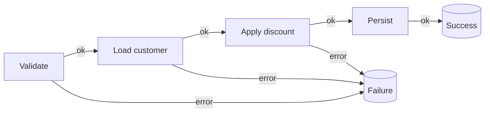

## The problem: exceptions for things that aren't exceptional

"The email is already taken." "The coupon expired." "Insufficient funds." None of these are *bugs* - they're ordinary, expected outcomes of business rules. Yet most codebases model them by throwing:

```csharp
public User Register(string email)
{
    if (_users.Exists(email))
        throw new InvalidOperationException("Email already taken."); // expected, but thrown
    // ...
}
```

Using exceptions for expected failures has real costs: they're invisible in the method signature (the caller has no idea what can go wrong), they're expensive when thrown on hot paths, and they push error handling far away into a `catch` that doesn't know the context. The **Result pattern** makes the outcome part of the return type: a method returns *either* a success value *or* an error - and the compiler makes you deal with both.

## A minimal Result type

You don't need a library to start (though good ones exist - see the end). Here's a focused, immutable `Result<T>`:

```csharp
public sealed record Error(string Code, string Message)
{
    public static readonly Error None = new("", "");
}

public readonly struct Result<T>
{
    public bool IsSuccess { get; }
    private readonly T _value;          // stored unconditionally; only valid when IsSuccess
    public Error Error { get; }

    private Result(bool isSuccess, T value, Error error)
    {
        IsSuccess = isSuccess;
        _value = value;
        Error = error;
    }

    // Accessing Value on a failure is a programming error - fail loud instead of returning null/default.
    public T Value => IsSuccess
        ? _value
        : throw new InvalidOperationException("Cannot access Value of a failed Result.");

    public static Result<T> Success(T value) => new(true, value, Error.None);
    public static Result<T> Failure(Error error) => new(false, default!, error);

    // Implicit conversions keep call sites clean.
    public static implicit operator Result<T>(T value) => Success(value);
    public static implicit operator Result<T>(Error error) => Failure(error);
}
```

> **Two generics gotchas worth knowing.**
> 1. **Don't expose `T? Value`.** For a *value* type, `T?` becomes `Nullable<T>` (so `Result<int>.Value` is `int?` - a different type than `int`); for a *reference* type it's just an annotation. That asymmetry is confusing and leaks "default-or-null" into your success path. Storing `T` privately and throwing on misuse (above) gives one clear contract regardless of whether `T` is a struct or a class.
> 2. **`Success(null)` is reachable** via the implicit operator (`return (User)null;`). If "success carries a value" matters to you, guard it in `Success` (`ArgumentNullException.ThrowIfNull(value)`), or use a non-generic `Result` for the no-value case (below).

Now the intent is in the signature, and there's nothing to throw:

```csharp
public Result<User> Register(string email)
{
    if (_users.Exists(email))
        return new Error("user.email_taken", "That email is already registered.");

    var user = User.Create(email);
    _users.Add(user);
    return user; // implicit Success
}
```

The caller *cannot* reach the value without first checking `IsSuccess` - there's no `null` to accidentally dereference.

## A non-generic Result for operations that return nothing

Not every step produces a value. "Persist" or "send email" succeed or fail but carry no payload - and forcing a `Result<Unit>` or `Result<bool>` there is noise. Add a sibling type:

```csharp
public readonly struct Result
{
    public bool IsSuccess { get; }
    public Error Error { get; }

    private Result(bool ok, Error error) { IsSuccess = ok; Error = error; }

    public static Result Success() => new(true, Error.None);
    public static Result Failure(Error error) => new(false, error);
    public static implicit operator Result(Error error) => Failure(error);
}
```

Now `Result Persist(Order order)` reads honestly - it either worked or it didn't.

## Railway-oriented programming: composing results

Real use-cases are pipelines of steps that each may fail: validate → load → apply a rule → persist. Imperatively that becomes a staircase of `if (!result.IsSuccess) return result;`. **Railway-oriented programming** models it as two tracks - success and failure - where any failure short-circuits to the end. Add a few combinators:

```csharp
public static class ResultExtensions
{
    // Map: transform the success value; failure passes through untouched.
    public static Result<TOut> Map<TIn, TOut>(
        this Result<TIn> result, Func<TIn, TOut> map) =>
        result.IsSuccess ? Result<TOut>.Success(map(result.Value)) : result.Error;

    // Bind: run the next result-returning step only if we're still on the success track.
    public static Result<TOut> Bind<TIn, TOut>(
        this Result<TIn> result, Func<TIn, Result<TOut>> next) =>
        result.IsSuccess ? next(result.Value) : result.Error;

    // Match: collapse both tracks into a single value (e.g. an HTTP response).
    public static TOut Match<TIn, TOut>(
        this Result<TIn> result, Func<TIn, TOut> onSuccess, Func<Error, TOut> onFailure) =>
        result.IsSuccess ? onSuccess(result.Value) : onFailure(result.Error);
}
```



A whole *synchronous* use-case reads as one track, with failures falling through automatically:

```csharp
public Result<Receipt> Checkout(CheckoutRequest request) =>
    ValidateRequest(request)
        .Bind(LoadCustomer)
        .Bind(customer => ApplyDiscount(customer, request.Coupon))
        .Bind(Persist)
        .Map(order => new Receipt(order.Id, order.Total));
```

No `try/catch`, no nested `if`s - every step declares its own failure, and the first one to fail wins.

## The part most tutorials skip: async railway

Here's the catch that makes the synchronous version above a toy in real .NET: **`LoadCustomer` and `Persist` are async.** They return `Task<Result<Customer>>`, and the sync `Bind`/`Map` above **don't compose over `Task`** - you'd be back to `await`-ing and re-checking `IsSuccess` by hand. A production Result pattern *must* ship async combinators:

```csharp
public static class AsyncResultExtensions
{
    // Bind where the next step is async, starting from an already-awaited Result.
    public static async Task<Result<TOut>> Bind<TIn, TOut>(
        this Result<TIn> result, Func<TIn, Task<Result<TOut>>> next) =>
        result.IsSuccess ? await next(result.Value) : result.Error;

    // Bind where the SOURCE is a Task<Result<>> (lets you chain .Bind off a previous async step).
    public static async Task<Result<TOut>> Bind<TIn, TOut>(
        this Task<Result<TIn>> resultTask, Func<TIn, Task<Result<TOut>>> next)
    {
        var result = await resultTask;
        return result.IsSuccess ? await next(result.Value) : result.Error;
    }

    public static async Task<Result<TOut>> Map<TIn, TOut>(
        this Task<Result<TIn>> resultTask, Func<TIn, TOut> map)
    {
        var result = await resultTask;
        return result.IsSuccess ? Result<TOut>.Success(map(result.Value)) : result.Error;
    }

    public static async Task<TOut> Match<TIn, TOut>(
        this Task<Result<TIn>> resultTask, Func<TIn, TOut> onSuccess, Func<Error, TOut> onFailure)
    {
        var result = await resultTask;
        return result.IsSuccess ? onSuccess(result.Value) : onFailure(result.Error);
    }
}
```

Now the *real* checkout - every step `async` - reads exactly as cleanly as the sync one, with no manual `IsSuccess` plumbing:

```csharp
public Task<Result<Receipt>> CheckoutAsync(CheckoutRequest request, CancellationToken ct) =>
    ValidateRequest(request)                                  // Result<CheckoutRequest>
        .Bind(req => LoadCustomerAsync(req, ct))              // Task<Result<Customer>>
        .Bind(customer => ApplyDiscountAsync(customer, request.Coupon, ct))
        .Bind(order => PersistAsync(order, ct))
        .Map(order => new Receipt(order.Id, order.Total));
```

**This is the difference between a concept and something you can ship.** Without the async overloads, the Result pattern collapses the moment a step touches a database - which is every real step. Provide both sets of combinators (or use a library that does).

## Aggregating errors (validation returns *many*)

A single `Error` is right for "the first thing that went wrong." But validation typically produces *several* failures at once ("email invalid" AND "password too short"), and returning only the first is a poor API. Support a multi-error result for that boundary:

```csharp
public sealed record ValidationError(IReadOnlyList<Error> Errors)
    : Error("validation.failed", "One or more validation errors occurred.");

// Collect every rule failure instead of stopping at the first.
public Result<CheckoutRequest> ValidateRequest(CheckoutRequest request)
{
    var errors = new List<Error>();
    if (request.Lines.Count == 0) errors.Add(new("cart.empty", "Cart is empty."));
    if (request.Total <= 0)       errors.Add(new("cart.total_invalid", "Total must be positive."));

    return errors.Count == 0 ? request : new ValidationError(errors);
}
```

This pairs naturally with FluentValidation, whose `ValidationResult.Errors` is already a list - map each `ValidationFailure` to an `Error` and wrap them.

## Turning a Result into an HTTP response - with ProblemDetails

`Match` is where the railway meets the edge of your app. Don't hand back a bare error object - map to **`ProblemDetails`** (RFC 7807), the .NET standard shape for API errors, so clients get a consistent, typed body:

```csharp
app.MapPost("/checkout", (CheckoutRequest request, CheckoutService service, CancellationToken ct) =>
    service.CheckoutAsync(request, ct).Match(
        onSuccess: receipt => Results.Ok(receipt),
        onFailure: error => error switch
        {
            ValidationError v => Results.ValidationProblem(
                v.Errors.ToDictionary(e => e.Code, e => new[] { e.Message })),

            { Code: "user.email_taken" } => Results.Problem(
                title: error.Message, statusCode: StatusCodes.Status409Conflict, type: error.Code),

            { Code: "coupon.expired" } => Results.Problem(
                title: error.Message, statusCode: StatusCodes.Status400BadRequest, type: error.Code),

            _ => Results.Problem(
                title: error.Message, statusCode: StatusCodes.Status422UnprocessableEntity, type: error.Code),
        }));
```

The endpoint has no `try/catch`. Every expected failure is a value that maps to a status code and a standard body; only *truly* unexpected faults (a dropped database connection) still throw and hit your global exception handler - which is exactly what exceptions are for.

## Is it actually faster? A quick benchmark

The "exceptions are expensive" claim is worth grounding. A rough BenchmarkDotNet sketch comparing a thrown-and-caught expected failure against a returned `Result` on the failure path:

```csharp
[Benchmark(Baseline = true)]
public bool ThrowOnExpectedFailure()
{
    try { RegisterThrowing("taken@acme.io"); return false; }
    catch (InvalidOperationException) { return true; }
}

[Benchmark]
public bool ReturnResultOnExpectedFailure() =>
    RegisterResult("taken@acme.io").IsSuccess == false;
```

On typical hardware the thrown path runs on the order of **microseconds**, the Result path on the order of **nanoseconds** - roughly a 100–1000× difference *on the failure path*, plus zero allocations for a `readonly struct` result. On a hot validation path (think per-request rule checks) that's real. On a cold path that fails once an hour, it's irrelevant - choose Result for *clarity and signature honesty* first, and treat the perf win as a bonus where the path is hot. (Numbers vary by runtime and stack depth; measure your own.)

## Pros & cons

**Pros**
- Failures are explicit in the type signature - callers can't forget them.
- No exception cost or control-flow-by-throw on expected paths.
- Composes cleanly with `Bind`/`Map`/`Match` - **synchronously and across async steps**.
- Maps naturally onto HTTP status codes and ProblemDetails at the boundary.

**Cons**
- More ceremony than `throw` for trivial code; combinators have a learning curve.
- You must provide async combinators or the pattern doesn't survive contact with a database.
- Mixing Result *and* exceptions inconsistently is worse than either alone - pick a convention.
- A `Result` that carries only a string message loses structure; use an `Error` with a code (and a multi-error variant for validation).

## Where to use / NOT to use

**Use it when** failures are expected domain outcomes (validation, business rules, "not found", conflicts) - especially in application/handler layers and APIs.

**Avoid it when:**
- The failure is truly exceptional and unrecoverable (out of memory, programming bug) - let it throw.
- You're deep in low-level/library code where exceptions are the established contract.
- The team won't adopt it consistently - half-Result, half-exception is the worst of both.

> You don't have to hand-roll this. Mature libraries - **ErrorOr**, **FluentResults**, **CSharpFunctionalExtensions** - provide a battle-tested `Result`/`Error` *with async combinators and error aggregation already built in*. Start with one of them unless you have a reason not to; the concepts in this chapter map directly onto all of them.

## Key takeaways

1. Model *expected* failures as return values (`Result<T>`), not thrown exceptions.
2. Put an `Error` with a **code** in the failure case so callers can branch on it; add a **multi-error** variant for validation.
3. Compose steps with `Bind`/`Map` and collapse with `Match` - and ship **async** overloads, or the pattern breaks at the first `await`.
4. Map to **ProblemDetails** at the boundary; keep a non-generic `Result` for no-value operations.
5. Keep real exceptions for the truly exceptional - and a global handler for those.
6. Prefer a proven library (ErrorOr/FluentResults) over a hand-rolled type in real projects.
