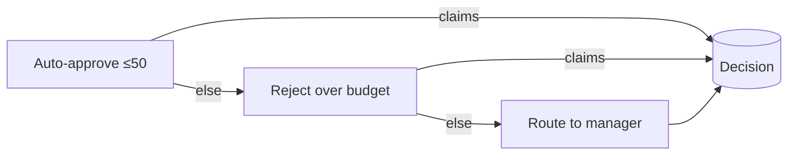

## The problem: one method doing the work of ten

A request comes in and needs many things done in order: authenticate, rate-limit, validate, enrich, log, then actually handle it. Cram that into one method and you get a 300-line procedure where every concern is tangled with every other, impossible to reorder or test in isolation.

**Chain of Responsibility** breaks that procedure into a chain of small handlers. Each handler does one thing and then decides whether to pass the request to the next link - or stop the chain. You already use the most successful implementation of this pattern every day: **ASP.NET Core middleware**.

## Chain of Responsibility vs. Pipeline - they aren't the same

The title pairs two names because they share machinery, but the *intent* differs, and conflating them causes design mistakes:

- **Chain of Responsibility:** handlers compete to *handle* the request; the first one that can, does, and the rest are skipped. Think "find the one handler responsible for this." (Approval rules, support-ticket routing.)
- **Pipeline:** *every* stage runs in order, each transforming the request and/or response; nobody "claims" it. Think "run all these steps around the request." (ASP.NET middleware, MediatR behaviors.)

The same `next()` plumbing powers both. The difference is whether a handler *terminating early* is the normal case (CoR) or the exception (pipeline). We'll build a CoR example (approval) and point at the pipeline examples you already use.

## You already use it: ASP.NET Core middleware (a pipeline)

The request pipeline *is* this pattern. Each middleware receives the context and a `next` delegate, does its work before and/or after calling `next`, and can short-circuit by simply not calling it:

```csharp
app.Use(async (context, next) =>
{
    var sw = Stopwatch.GetTimestamp();
    await next(context); // pass to the next link…
    var ms = Stopwatch.GetElapsedTime(sw).TotalMilliseconds;
    context.Response.Headers["X-Response-Time-ms"] = ms.ToString("0");
});

app.UseAuthentication(); // a link that can short-circuit with 401
app.UseAuthorization();
app.MapControllers();    // the terminal handler
```

`UseAuthentication` can stop the chain (return 401) by *not* invoking `next`. That short-circuit ability is the heart of the pattern: a handler either handles the request or delegates.

## Building your own typed pipeline (a CoR for domain rules)

Middleware is HTTP-specific. The same pattern shines for **domain** processing - say, deciding whether an expense report is auto-approved. Each rule is a handler that can approve, reject, or defer to the next rule. Real approval rules call services (budget lookups, fraud checks), so we'll build it **async** from the start.

Define a handler and a context that flows through. Note: there's **no `Handled` flag** - a handler "claims" the request simply by *returning a decision instead of calling `next`*. A flag that nothing reads is just a trap for the next maintainer:

```csharp
public sealed record ApprovalContext(Expense Expense);

public interface IApprovalHandler
{
    Task<ApprovalDecision> HandleAsync(
        ApprovalContext context,
        Func<ApprovalContext, Task<ApprovalDecision>> next,
        CancellationToken ct);
}
```

Each handler is small and single-purpose, and decides whether to continue:

```csharp
public sealed class AutoApproveSmallAmounts : IApprovalHandler
{
    public Task<ApprovalDecision> HandleAsync(
        ApprovalContext ctx, Func<ApprovalContext, Task<ApprovalDecision>> next, CancellationToken ct) =>
        ctx.Expense.Amount <= 50m
            ? Task.FromResult(ApprovalDecision.AutoApproved)  // I claim it - chain stops here
            : next(ctx);                                       // not my job - pass it on
}

public sealed class RejectOverBudget(IBudgetService budgets) : IApprovalHandler
{
    public async Task<ApprovalDecision> HandleAsync(
        ApprovalContext ctx, Func<ApprovalContext, Task<ApprovalDecision>> next, CancellationToken ct)
    {
        var remaining = await budgets.RemainingAsync(ctx.Expense.Department, ct); // real async work
        return ctx.Expense.Amount > remaining
            ? ApprovalDecision.Rejected
            : await next(ctx);
    }
}

public sealed class RouteToManager : IApprovalHandler // terminal: always claims, never calls next
{
    public Task<ApprovalDecision> HandleAsync(
        ApprovalContext ctx, Func<ApprovalContext, Task<ApprovalDecision>> next, CancellationToken ct) =>
        Task.FromResult(ApprovalDecision.NeedsManager);
}
```



### Compose once, run many times

Build the chain right-to-left so each link closes over the next. Crucially, **compose it once in the constructor**, not on every call - the composition is deterministic, so rebuilding the closures per request is needless allocation on a hot path:

```csharp
public sealed class ApprovalPipeline
{
    private readonly Func<ApprovalContext, Task<ApprovalDecision>> _entry;

    public ApprovalPipeline(IEnumerable<IApprovalHandler> handlers)
    {
        var ordered = handlers.ToArray();

        // Guard against the #1 CoR bug: a chain with no terminal handler falls off the end.
        // Fail fast at startup, not with a NullReferenceException at 3am.
        if (ordered is [] || ordered[^1] is not RouteToManager)
            throw new InvalidOperationException(
                "Approval chain must end with a terminal handler (RouteToManager).");

        // End of the line: this is never actually reached because the terminal handler
        // always claims - but it makes the absence of a fall-through explicit and safe.
        Func<ApprovalContext, Task<ApprovalDecision>> chain =
            _ => throw new InvalidOperationException("Approval chain fell through with no decision.");

        for (int i = ordered.Length - 1; i >= 0; i--)
        {
            var handler = ordered[i];
            var next = chain;
            chain = (ctx) => handler.HandleAsync(ctx, next, CancellationToken.None);
        }
        _entry = chain;
    }

    public Task<ApprovalDecision> DecideAsync(Expense expense) =>
        _entry(new ApprovalContext(expense));
}
```

Because we guarantee a terminal handler *at construction*, `DecideAsync` always returns a real decision - there's no `Decision!.Value` non-null assertion gambling on a value that might not be there. **Either the chain is well-formed (checked once at startup) or the app refuses to start.** That's the right place to catch "you forgot the terminal handler," not in production.

```csharp
// Order = priority. Reorder the registrations and you reorder the policy.
builder.Services.AddScoped<IApprovalHandler, AutoApproveSmallAmounts>();
builder.Services.AddScoped<IApprovalHandler, RejectOverBudget>();
builder.Services.AddScoped<IApprovalHandler, RouteToManager>(); // terminal must be last
builder.Services.AddScoped<ApprovalPipeline>();
```

Adding a rule ("flag anything from a new vendor") is a new handler and one registration - no existing handler changes. Reordering the policy is reordering the list.

> **What if a handler throws mid-chain?** A rule that calls a flaky service can throw. Decide deliberately: either let it propagate (a budget service outage *should* fail the request loudly), or add a try/catch *handler* as the outermost link that maps infrastructure failures to a safe default (e.g. `NeedsManager`). Don't bury the try/catch inside a business rule - make "what happens on infrastructure failure" its own, testable link.

### Testing a single handler

Each handler is a pure function of `(context, next)` - test it in isolation with a fake `next`:

```csharp
[Fact]
public async Task AutoApprove_claims_small_amounts_and_does_not_call_next()
{
    var sut = new AutoApproveSmallAmounts();
    var nextCalled = false;
    Func<ApprovalContext, Task<ApprovalDecision>> next =
        _ => { nextCalled = true; return Task.FromResult(ApprovalDecision.NeedsManager); };

    var decision = await sut.HandleAsync(
        new ApprovalContext(new Expense { Amount = 20m }), next, default);

    Assert.Equal(ApprovalDecision.AutoApproved, decision);
    Assert.False(nextCalled); // it claimed the request - the rest of the chain never ran
}
```

## Relationship to Mediator pipeline behaviors

If you use MediatR, its `IPipelineBehavior` is this exact pattern applied to the request pipeline (each behavior calls `next()`), and ASP.NET middleware is it applied to HTTP. Reach for a *hand-built* chain like the one above when the steps are **domain logic** (approval rules, fraud checks, document processing) rather than infrastructure concerns - and when the *CoR semantics* (first handler claims, rest skip) are what you want, which MediatR behaviors don't give you (every behavior runs).

## Pros & cons

**Pros**
- Each handler is single-responsibility and independently testable.
- Order is explicit and changeable; adding a step doesn't touch existing steps (Open/Closed).
- Any handler can short-circuit, so you don't run work you don't need.
- Composed once at startup - no per-request rebuild cost.

**Cons**
- The flow is indirect - you must read the registration order to know what runs.
- A request can fall off the end unhandled if you forget a terminal handler - validate that at construction.
- Over-applied, it turns a simple `if/else` into many files.

## Where to use / NOT to use

**Use it when** a request passes through several independent steps, the set/order changes over time, and steps may stop the flow (middleware, validation/enrichment, rules engines, processing pipelines).

**Avoid it when:**
- There are two or three fixed steps that never change - inline them.
- Every handler always runs and never short-circuits - that's a *pipeline* you can express with a `foreach` or MediatR behaviors, not a hand-rolled CoR.
- The steps need rich shared state and results - consider a Mediator with behaviors instead.

## Key takeaways

1. Chain of Responsibility = focused handlers, each deciding whether to pass to `next`; a **Pipeline** runs every stage. Same plumbing, different intent.
2. ASP.NET Core middleware and MediatR behaviors are the pipeline form you already use.
3. Build domain chains for rules/approvals; compose right-to-left **once** in the constructor so each link wraps the next.
4. Make the chain **async** - real rules call services - and validate the **terminal handler at startup** so nothing falls off the end (no `!.Value` gambling).
5. Registration order is the policy - reordering changes behavior with no code edits. Decide explicitly what happens when a handler throws.
