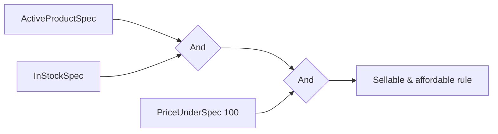

## The problem: the repository method explosion

It always starts innocently: `GetActiveProducts()`. Then `GetActiveProductsInCategory(id)`. Then `GetActiveProductsInCategoryUnderPrice(id, price)`. Then a marketing campaign needs `GetDiscountedActiveProductsInStock()`. Six months later the repository has forty near-duplicate methods, each baking a slightly different filter into a one-off query, none of them reusable or testable on their own.

The root issue: **business rules ("a product is *sellable* if it's active, in stock, and not discontinued") are scattered across query methods** instead of living somewhere you can name, test, and combine. The **Specification pattern** turns each rule into a first-class object you can compose with `And`/`Or`/`Not` - and, crucially in .NET, translate to SQL through EF Core.

## A specification that EF Core can translate

The key is to express the rule as an `Expression<Func<T, bool>>` (not a compiled `Func`), so EF Core can turn it into SQL instead of pulling the whole table into memory:

```csharp
public abstract class Specification<T>
{
    public abstract Expression<Func<T, bool>> ToExpression();

    // In-memory check - handy in the domain layer and unit tests.
    public bool IsSatisfiedBy(T candidate) => ToExpression().Compile()(candidate);

    public Specification<T> And(Specification<T> other) => new AndSpecification<T>(this, other);
    public Specification<T> Or(Specification<T> other)  => new OrSpecification<T>(this, other);
    public Specification<T> Not()                       => new NotSpecification<T>(this);
}
```

Each concrete spec names one rule:

```csharp
public sealed class ActiveProductSpec : Specification<Product>
{
    public override Expression<Func<Product, bool>> ToExpression() => p => p.IsActive;
}

public sealed class InStockSpec : Specification<Product>
{
    public override Expression<Func<Product, bool>> ToExpression() => p => p.StockQuantity > 0;
}

public sealed class PriceUnderSpec(decimal max) : Specification<Product>
{
    public override Expression<Func<Product, bool>> ToExpression() => p => p.Price < max;
}
```

## Composing specifications - the right way to merge expression trees

This is the part that's easy to get *wrong*, and getting it wrong throws at runtime against a real database. To combine two specs you must produce a **single** expression tree whose body references **one** lambda parameter. The naive approach - `Expression.Invoke(left, param)` + `Expression.Invoke(right, param)` + `Expression.AndAlso` - produces `InvocationExpression` nodes that **EF Core does not reliably translate**; you'll get *"The LINQ expression could not be translated"* the first time you run it as a query. (This is a known EF Core limitation, not a quirk of one provider.)

The correct technique is to **rewrite the second expression's parameter** to be the *same* parameter instance as the first, using an `ExpressionVisitor`, and then combine the raw bodies. No `Invoke`, fully translatable:

```csharp
// Rewrites every reference to one parameter into another - the key to translatable merging.
internal sealed class ParameterReplacer(ParameterExpression from, ParameterExpression to)
    : ExpressionVisitor
{
    protected override Expression VisitParameter(ParameterExpression node) =>
        node == from ? to : base.VisitParameter(node);
}

internal static class SpecCombiner
{
    public static Expression<Func<T, bool>> Combine<T>(
        Expression<Func<T, bool>> left,
        Expression<Func<T, bool>> right,
        Func<Expression, Expression, Expression> merge)
    {
        var parameter = Expression.Parameter(typeof(T));

        // Rebind both bodies onto ONE shared parameter - no Expression.Invoke anywhere.
        var leftBody  = new ParameterReplacer(left.Parameters[0],  parameter).Visit(left.Body);
        var rightBody = new ParameterReplacer(right.Parameters[0], parameter).Visit(right.Body);

        return Expression.Lambda<Func<T, bool>>(merge(leftBody, rightBody), parameter);
    }
}
```

Now the combinators are three trivial lines each, and every one of them translates to SQL:

```csharp
internal sealed class AndSpecification<T>(Specification<T> left, Specification<T> right)
    : Specification<T>
{
    public override Expression<Func<T, bool>> ToExpression() =>
        SpecCombiner.Combine(left.ToExpression(), right.ToExpression(), Expression.AndAlso);
}

internal sealed class OrSpecification<T>(Specification<T> left, Specification<T> right)
    : Specification<T>
{
    public override Expression<Func<T, bool>> ToExpression() =>
        SpecCombiner.Combine(left.ToExpression(), right.ToExpression(), Expression.OrElse);
}

internal sealed class NotSpecification<T>(Specification<T> inner) : Specification<T>
{
    public override Expression<Func<T, bool>> ToExpression()
    {
        var expr = inner.ToExpression();
        return Expression.Lambda<Func<T, bool>>(Expression.Not(expr.Body), expr.Parameters);
    }
}
```



> **Why this matters so much:** the `Invoke`-based version *looks* right and even works for `IsSatisfiedBy` (in-memory, where the expression is compiled), so it passes a naive unit test - then explodes the first time it hits the database. The parameter-rebinding version above is what production code (and the libraries below) actually do.

> In production, don't hand-roll even this - use **LINQKit**'s `PredicateBuilder`/`Expand`, or the **Ardalis.Specification** library, which also handles includes, ordering and paging. The point here is to show you the *correct shape* so you understand what those libraries do under the hood (and why `Invoke` isn't it).

## Using it against EF Core

A single repository method takes *any* specification and applies it as a `Where` - EF Core translates it to a parameterized SQL `WHERE`:

```csharp
public sealed class ProductRepository(AppDbContext db)
{
    public async Task<IReadOnlyList<Product>> FindAsync(
        Specification<Product> spec, CancellationToken ct = default) =>
        await db.Products.Where(spec.ToExpression()).ToListAsync(ct);
}
```

Now "sellable products under €100" is composed at the call site from named, reusable rules - no new repository method, real SQL, no in-memory filtering:

```csharp
var sellableAndCheap = new ActiveProductSpec()
    .And(new InStockSpec())
    .And(new PriceUnderSpec(100m));

var products = await repository.FindAsync(sellableAndCheap, ct);
```

### Prove it's real SQL, not in-memory filtering

The whole value proposition rests on this composing into a SQL `WHERE`. With the parameter-rebinding combinator, EF Core produces exactly that - `100` becomes a parameter, and the database does the filtering:

```sql
SELECT [p].[Id], [p].[Name], [p].[Price], [p].[StockQuantity], [p].[IsActive]
FROM [Products] AS [p]
WHERE [p].[IsActive] = CAST(1 AS bit)
  AND [p].[StockQuantity] > 0
  AND [p].[Price] < @__max_0
```

If instead you saw EF Core warn about client evaluation - or throw *"could not be translated"* - that's the signature of the `Invoke` mistake. Capture the generated SQL once (`.ToQueryString()` on the `IQueryable`) and eyeball it; it's the fastest way to confirm a spec stays server-side.

## The real payoff: one rule, two uses

The same `ActiveProductSpec` is reused in the domain layer to validate a single entity - `spec.IsSatisfiedBy(product)` - so the rule for "active" is defined **once** and used both in queries and in business logic. That single-source-of-truth property is what justifies the machinery:

```csharp
[Fact]
public void Sellable_spec_is_satisfied_only_when_active_and_in_stock_and_cheap()
{
    var sellableAndCheap = new ActiveProductSpec()
        .And(new InStockSpec())
        .And(new PriceUnderSpec(100m));

    Assert.True(sellableAndCheap.IsSatisfiedBy(
        new Product { IsActive = true, StockQuantity = 5, Price = 80m }));

    Assert.False(sellableAndCheap.IsSatisfiedBy(
        new Product { IsActive = true, StockQuantity = 0, Price = 80m })); // out of stock
}
```

The *same object* powering this test is the one that runs as SQL in `FindAsync` - that's the property no pile of `GetActiveProductsUnderPrice` methods can give you.

> **Perf note on `IsSatisfiedBy`:** it calls `ToExpression().Compile()` every invocation, and compiling an expression tree isn't free (microseconds, plus a one-time JIT). Fine for a handful of validations; if you call it in a tight loop over thousands of entities, cache the compiled `Func<T,bool>` once per spec instance rather than recompiling each call.

## When you outgrow a bare `Where`

Real queries need more than a predicate - includes, ordering, paging. A spec that only carries `Expression<Func<T,bool>>` can't express "include the category, order by price, take 20." That's the boundary where you stop hand-rolling and adopt **Ardalis.Specification**, which models all of that (`AddInclude`, `ApplyOrderBy`, `ApplyPaging`) on the same composable base. Hand-roll the predicate-only spec to learn the shape and for simple filters; reach for the library the moment you need shaping beyond `WHERE`.

## Pros & cons

**Pros**
- Business rules become named, reusable, unit-testable objects.
- Compose with `And`/`Or`/`Not` instead of writing a new query per combination.
- Expression-based specs translate to SQL - no loading the table into memory.
- The same rule works in queries *and* in-memory validation.

**Cons**
- Expression-tree composition is fiddly to hand-roll - and the obvious `Invoke` approach silently breaks under EF Core (use parameter rebinding, or a library).
- Over-applied, trivial one-off filters become unnecessary classes.
- Specs that need joins/includes/paging push you toward a richer library (Ardalis.Specification).

## Where to use / NOT to use

**Use it when** the same business rules recur across queries and domain logic, filters combine in many ways, or you want to keep query logic out of bloated repositories.

**Avoid it when:**
- A query is used once and won't combine - an inline `Where` is clearer.
- The rule can't be expressed as an expression EF Core can translate (then it's domain logic, not a query spec).
- You'd build the whole machinery for two simple filters - that's over-engineering.

## Key takeaways

1. A specification turns a business rule into a composable, testable object.
2. Express rules as `Expression<Func<T,bool>>` so EF Core translates them to SQL.
3. Merge expressions by **rebinding the parameter with an `ExpressionVisitor`** - never `Expression.Invoke`, which EF Core can't translate.
4. Confirm specs stay server-side with `.ToQueryString()`; reuse the same spec for queries and in-memory validation.
5. Use **Ardalis.Specification** or **LINQKit** in production - especially once you need includes, ordering, or paging.
