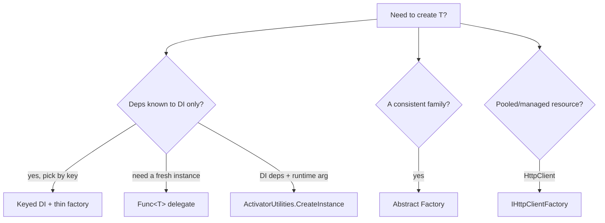

## The problem: `new` welds you to a concrete type

The moment a method does `new SmtpEmailSender(...)`, it's married to SMTP forever. Want SendGrid in prod and a fake in tests? You can't, without editing that method. Creating objects is a responsibility of its own, and the **Factory** family of patterns extracts it so the *what-to-create* decision lives in one place and the *use* stays decoupled from the concrete type.

We'll model one realistic need: sending a notification over a channel chosen at runtime (email, SMS, push).

```csharp
public interface INotificationSender
{
    Task SendAsync(string to, string message, CancellationToken ct = default);
}

public sealed class EmailSender(ISmtpClient smtp) : INotificationSender { /* ... */ }
public sealed class SmsSender(ITwilioClient twilio) : INotificationSender { /* ... */ }
public sealed class PushSender(IFirebaseClient fcm) : INotificationSender { /* ... */ }
```

## A factory you already use: `IHttpClientFactory`

Before writing any factory, recognize the most important one in .NET - the framework's own. `HttpClient` is notoriously easy to misuse (socket exhaustion if you `new` one per call, stale DNS if you keep one forever). The framework's answer is a **factory** that pools and recycles handlers for you:

```csharp
builder.Services.AddHttpClient<CatalogClient>(c => c.BaseAddress = new Uri("https://catalog.internal"));

public sealed class CatalogClient(HttpClient http)            // the factory injected a managed client
{
    public Task<Product?> GetAsync(int id) =>
        http.GetFromJsonAsync<Product>($"/products/{id}");
}
```

You never call `new HttpClient()`; `IHttpClientFactory` decides *which* handler to hand you and when to rotate it. That's the Factory pattern doing real work in the BCL - proof that "extract object creation" isn't academic. Keep it in mind as the bar: a good factory hides a creation *decision* you genuinely don't want at the call site.

## Factory Method (the classic)

Factory Method defines a creator with a method subclasses override to decide the concrete product. It's the textbook form - useful to recognize, rarely the best fit in DI-first .NET:

```csharp
public abstract class NotificationCreator
{
    protected abstract INotificationSender CreateSender();   // the factory method

    public Task NotifyAsync(string to, string message) =>
        CreateSender().SendAsync(to, message);
}

public sealed class EmailNotificationCreator : NotificationCreator
{
    protected override INotificationSender CreateSender() => new EmailSender(/* ... */);
}
```

The weakness in modern .NET: `new EmailSender(...)` inside the creator can't pull dependencies (`ISmtpClient`) from the container. That's why the idiomatic forms below hand creation to DI.

> **A familiar Factory Method you've already met:** a *static* factory method like `EmailAddress.Parse(...)` from the Builder chapter is the simplest member of this family - a named creation method that can validate and return a ready value object, with a private constructor preventing any other way in. Not every factory is a class; sometimes it's one well-named static method.

## Abstract Factory (families of related objects)

Abstract Factory creates *families* that must be used together - e.g. a full UI theme (button + checkbox) or a cloud provider's (storage + queue). One factory, several related products:

```csharp
public interface ICloudFactory
{
    IFileStorage CreateStorage();
    IMessageQueue CreateQueue();
}

public sealed class AwsCloudFactory(IAmazonS3 s3, ISqsClient sqs, IConfiguration cfg) : ICloudFactory
{
    // Build the products explicitly from their real dependencies - consistent with how
    // S3StorageAdapter is constructed in the Adapter chapter (it needs a bucket name).
    public IFileStorage CreateStorage() => new S3StorageAdapter(s3, cfg["Storage:Bucket"]!);
    public IMessageQueue CreateQueue()  => new SqsQueue(sqs, cfg["Queue:Url"]!);
}
```

> **Why not `sp.GetRequiredService<S3StorageAdapter>()` here?** Because `S3StorageAdapter` needs a `string bucket` constructor argument the container can't supply on its own - resolving the concrete type would throw unless you'd separately registered it with that argument. Build products that need runtime/config values *explicitly* (as above), or register them with a factory lambda. Don't pretend the container can materialize a type whose constructor it can't satisfy.

Use Abstract Factory when the products are a *set* that must stay consistent (you never want AWS storage with Azure queues).

## The modern .NET way #1 - keyed DI as a factory

Since .NET 8, the container itself is your factory. Register each implementation under a key; resolve by key:

```csharp
builder.Services.AddKeyedScoped<INotificationSender, EmailSender>(Channel.Email);
builder.Services.AddKeyedScoped<INotificationSender, SmsSender>(Channel.Sms);
builder.Services.AddKeyedScoped<INotificationSender, PushSender>(Channel.Push);
```

Wrap resolution in a tiny factory so callers don't depend on the container directly - this is the form you'll use most:

```csharp
public interface INotificationFactory { INotificationSender For(Channel channel); }

public sealed class NotificationFactory(IServiceProvider sp) : INotificationFactory
{
    public INotificationSender For(Channel channel) =>
        sp.GetRequiredKeyedService<INotificationSender>(channel);
}
```

Every sender's own dependencies (`ISmtpClient`, `ITwilioClient`) are injected by the container - the thing Factory Method couldn't do.

> **The captive-dependency trap.** This factory holds `IServiceProvider`. If you register `NotificationFactory` as a **singleton** but the senders are **scoped**, the factory resolves scoped services from the *root* provider - silently giving you singleton-lifetime instances of things that were meant to be per-request, and `ObjectDisposedException`s when they outlive their scope. Register a provider-holding factory at the **same (or shorter) lifetime** as the things it resolves - here, scoped. Better still, inject `IServiceProvider`'s scoped instance (the one DI gives a scoped service) rather than the root.

## The modern .NET way #2 - factory delegates and ActivatorUtilities

When you need a *fresh* instance with a runtime argument the container doesn't know, two lightweight tools beat a custom factory class:

```csharp
// (a) A factory delegate: inject Func<T> and the container resolves a new one on call.
public sealed class ReportJob(Func<ReportProcessor> createProcessor)
{
    public void Run() { var processor = createProcessor(); /* ... */ }
}

// (b) ActivatorUtilities: build an object whose deps come from DI PLUS a runtime value.
var processor = ActivatorUtilities.CreateInstance<ReportProcessor>(sp, reportId);
```

`ActivatorUtilities.CreateInstance` fills constructor parameters from the container and lets you pass the rest (here `reportId`) explicitly - exactly the "DI + runtime arg" case that tempts people to write a bespoke factory.



## Testing a factory

A factory's job is "given input X, return the right concrete type." That's a one-line assertion per branch - and it's worth writing because a mis-registered key is otherwise a runtime surprise:

```csharp
[Fact]
public void NotificationFactory_resolves_the_sender_registered_for_the_channel()
{
    var services = new ServiceCollection();
    services.AddKeyedScoped<INotificationSender, SmsSender>(Channel.Sms);
    services.AddSingleton<ISmtpClient, FakeSmtp>(); // (deps for other senders, omitted)
    using var sp = services.BuildServiceProvider();

    var sut = new NotificationFactory(sp);

    Assert.IsType<SmsSender>(sut.For(Channel.Sms));
    Assert.Throws<InvalidOperationException>(() => sut.For(Channel.Push)); // unregistered key fails loud
}
```

## Pros & cons

**Pros**
- Decouples object *use* from object *creation*; swap implementations without touching callers.
- Centralizes the "which concrete type" decision in one place.
- In .NET, keyed DI / delegates / `IHttpClientFactory` give you factories with full dependency injection for free.

**Cons**
- Classic Factory Method fights DI (can't inject the product's dependencies).
- Easy to add a factory where the container already does the job - pure ceremony.
- A provider-holding factory at the wrong lifetime is a captive-dependency bug.
- Abstract Factory adds a lot of interfaces; only worth it for genuine product families.

## Where to use / NOT to use

**Use it when** the concrete type is chosen at runtime (by key/config), you need fresh instances with runtime arguments, or you must create a consistent family of related objects.

**Avoid it when:**
- DI can already inject the one implementation you need - just inject it.
- There's a single implementation and no runtime choice - a factory is overhead.
- You're reaching for classic Factory Method in a DI app - prefer keyed services or a delegate.

## Key takeaways

1. Factories separate *creating* an object from *using* it - `IHttpClientFactory` is the pattern doing real work in the BCL.
2. In modern .NET, **keyed DI + a thin factory** is the everyday Factory Method.
3. Use **`Func<T>`** for fresh instances and **`ActivatorUtilities.CreateInstance`** for "DI deps + runtime arg".
4. A static factory method (`EmailAddress.Parse`) is the simplest member of the family.
5. Watch the **captive-dependency** trap: a provider-holding factory must live no longer than what it resolves.
6. Use **Abstract Factory** only for families that must stay consistent - and if the container can already give you the object, don't write a factory.
