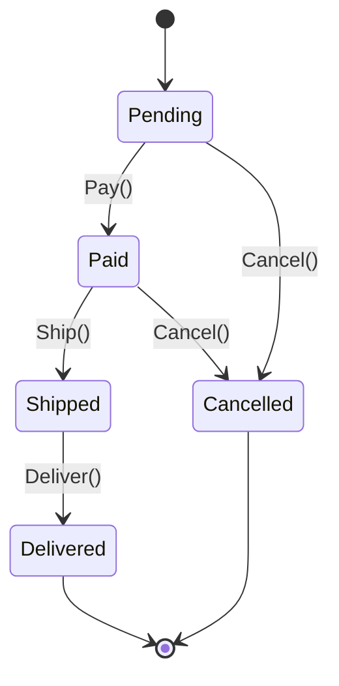

## The problem: boolean soup and illegal transitions

An order moves through a lifecycle: placed, paid, shipped, delivered - or cancelled. The naive model is a bag of flags:

```csharp
public sealed class Order
{
    public bool IsPaid { get; set; }
    public bool IsShipped { get; set; }
    public bool IsDelivered { get; set; }
    public bool IsCancelled { get; set; }
}
```

Now `IsShipped = true` while `IsPaid = false` is a representable - and disastrous - state. Every method that touches an order has to defensively check combinations of flags, and nothing stops you from shipping a cancelled order. The behavior also depends on the current state (you can cancel a *pending* order but not a *delivered* one), so the logic decays into nested `if`s on flag combinations.

The **State pattern** makes the order's status an explicit thing, makes each transition a deliberate operation, and makes illegal transitions *fail* instead of silently corrupting data.

## Step 1 - model states and transitions explicitly

Start with an honest enum and a domain object that owns its transitions. Each transition checks the current state and throws on an illegal move - there are no setters to bypass it. Note that **every** transition goes through the same `Require` guard, including `Cancel` (which simply allows more than one source state):

```csharp
public enum OrderState { Pending, Paid, Shipped, Delivered, Cancelled }

public sealed class Order
{
    public OrderState State { get; private set; } = OrderState.Pending;

    public void Pay()     => Transition(from: [OrderState.Pending], to: OrderState.Paid);
    public void Ship()    => Transition(from: [OrderState.Paid], to: OrderState.Shipped);
    public void Deliver() => Transition(from: [OrderState.Shipped], to: OrderState.Delivered);
    public void Cancel()  => Transition(from: [OrderState.Pending, OrderState.Paid], to: OrderState.Cancelled);

    // One guard for every transition - consistent, and the allowed sources are explicit.
    private void Transition(OrderState[] from, OrderState to)
    {
        if (!from.Contains(State))
            throw new InvalidOperationException(
                $"Cannot move to {to} from {State}; allowed only from [{string.Join(", ", from)}].");
        State = to;
    }
}
```



This alone fixes the bug class: `order.Ship()` on an unpaid order throws instead of producing a nonsensical record. For many domains, **this guarded-enum form is the right amount of State pattern** - don't over-build.

> **Earlier drafts of this model used a bespoke `Require(expected)` for the single-source transitions and a separate `if (State is Shipped or Delivered) throw` for `Cancel`. That inconsistency is a smell** - two ways to express the same idea. The single `Transition(from[], to)` guard above unifies them: every transition declares its allowed source states in one place, and `Cancel` is just the one with two sources.

## Transitions that return a Result instead of throwing

Throwing is right when an illegal transition is a *programming error*. But in a web flow, "user clicked Cancel on an already-shipped order" is an *expected* outcome you want to turn into a 409, not a 500. That's exactly the Result pattern from the earlier chapter - model the failure as a value:

```csharp
public Result Pay()  => Transition([OrderState.Pending], OrderState.Paid);
public Result Ship() => Transition([OrderState.Paid], OrderState.Shipped);

private Result Transition(OrderState[] from, OrderState to)
{
    if (!from.Contains(State))
        return new Error("order.illegal_transition", $"Cannot move to {to} from {State}.");
    State = to;
    return Result.Success();
}
```

```csharp
// The endpoint maps the expected failure to a status code - no try/catch.
app.MapPost("/orders/{id}/ship", async (int id, IOrderRepo repo, CancellationToken ct) =>
{
    var order = await repo.GetAsync(id, ct);
    return order.Ship().Match(
        onSuccess: () => Results.NoContent(),
        onFailure: e  => Results.Conflict(e));
});
```

Pick per layer: **throw** for invariant violations that should never happen if the code is correct; **return a `Result`** for transitions a user can legitimately attempt and be told "no." (See the Result chapter for `Match`/`Error`.)

## Step 2 - class-per-state, when behavior diverges

When each state carries genuinely different *behavior* (not just "is this transition allowed?"), promote each state to its own type. The classic State pattern: an interface per state, the context delegates to the current state object, and each state returns the next one. Because these state objects are **stateless**, expose them as cached singletons rather than allocating a new one on every transition:

```csharp
public interface IOrderState
{
    IOrderState Pay();
    IOrderState Ship();
    IOrderState Cancel();
    string Name { get; }
}

public sealed class PendingState : IOrderState
{
    public static readonly PendingState Instance = new();   // singleton - no per-transition allocation
    private PendingState() { }

    public string Name => "Pending";
    public IOrderState Pay()    => PaidState.Instance;
    public IOrderState Ship()   => throw Invalid("ship", Name);
    public IOrderState Cancel() => CancelledState.Instance;
    private static InvalidOperationException Invalid(string op, string s) =>
        new($"Cannot {op} a {s} order.");
}

public sealed class PaidState : IOrderState
{
    public static readonly PaidState Instance = new();
    private PaidState() { }

    public string Name => "Paid";
    public IOrderState Pay()    => throw new InvalidOperationException("Already paid.");
    public IOrderState Ship()   => ShippedState.Instance;
    public IOrderState Cancel() => CancelledState.Instance;
}
// ShippedState, DeliveredState, CancelledState similarly, each a singleton...
```

The context holds the current state and forwards calls - it never branches on a status field:

```csharp
public sealed class Order
{
    private IOrderState _state = PendingState.Instance;
    public string Status => _state.Name;

    public void Pay()    => _state = _state.Pay();
    public void Ship()   => _state = _state.Ship();
    public void Cancel() => _state = _state.Cancel();
}
```

Each state encapsulates *exactly* what is legal from there. Adding a `Refunded` state is a new class plus the transitions that reach it - no giant `switch` to hunt down and edit.

> **Persistence note:** store the simple `OrderState` enum (or its string) in the database, and rehydrate the right state object when you load the aggregate. Don't try to serialize the state *objects* themselves - map the enum back to the singleton:

```csharp
private static IOrderState FromEnum(OrderState s) => s switch
{
    OrderState.Pending   => PendingState.Instance,
    OrderState.Paid      => PaidState.Instance,
    OrderState.Shipped   => ShippedState.Instance,
    OrderState.Delivered => DeliveredState.Instance,
    OrderState.Cancelled => CancelledState.Instance,
    _ => throw new ArgumentOutOfRangeException(nameof(s)),
};
```

## The concurrency trap a state machine over a database must handle

Here's the bug that the guarded model alone does *not* fix: two requests load the same `Paid` order at the same time and both call `Ship()`. In memory each guard passes (both saw `Paid`); without protection you ship twice. A state machine persisted to a database needs **optimistic concurrency**:

```csharp
public sealed class Order
{
    public OrderState State { get; private set; } = OrderState.Pending;

    [Timestamp]                       // EF Core maps this to a SQL rowversion column
    public byte[] RowVersion { get; private set; } = [];
}
```

```csharp
try
{
    order.Ship();
    await db.SaveChangesAsync(ct);
}
catch (DbUpdateConcurrencyException)
{
    // Another request already transitioned this order - reload and decide (retry or report a conflict).
}
```

The in-memory guard makes illegal transitions *unrepresentable*; the rowversion check makes *concurrent* transitions safe. Real workflows need both - mention this whenever you put a state machine behind an HTTP endpoint.

## Entry / exit actions - and when to reach for a library

Real lifecycles do work *on* transition: send a confirmation email on entering `Shipped`, release inventory on entering `Cancelled`. You can hand-code that (run the side effect after a successful transition), but once you have many states with entry/exit actions, guard conditions, and triggers, a hand-rolled machine gets unwieldy fast.

That's the signal to adopt **[Stateless](https://github.com/dotnet-state-machine/stateless)**, the de-facto .NET state-machine library. It gives you declarative configuration - including `OnEntry`/`OnExit` actions, guarded triggers, and hierarchical states - plus a visual export (DOT/Mermaid) generated from the configuration, while keeping the same mental model from this chapter:

```csharp
var machine = new StateMachine<OrderState, OrderTrigger>(OrderState.Pending);

machine.Configure(OrderState.Paid)
    .Permit(OrderTrigger.Ship, OrderState.Shipped)
    .Permit(OrderTrigger.Cancel, OrderState.Cancelled);

machine.Configure(OrderState.Shipped)
    .OnEntry(() => emailSender.SendShipped(order))   // entry action
    .Permit(OrderTrigger.Deliver, OrderState.Delivered);
```

Hand-roll for a handful of states; switch to Stateless when entry/exit actions and guards start multiplying.

## Testing illegal transitions

The whole promise is "illegal transitions fail." Test that promise directly:

```csharp
[Fact]
public void Shipping_an_unpaid_order_is_rejected()
{
    var order = new Order(); // starts Pending

    var ex = Assert.Throws<InvalidOperationException>(() => order.Ship());
    Assert.Contains("from Pending", ex.Message);
    Assert.Equal(OrderState.Pending, order.State); // state unchanged after a rejected transition
}

[Fact]
public void Happy_path_walks_the_lifecycle()
{
    var order = new Order();
    order.Pay();
    order.Ship();
    order.Deliver();
    Assert.Equal(OrderState.Delivered, order.State);
}
```

The Result-returning variant gets the same coverage with `Assert.False(order.Ship().IsSuccess)` instead of `Assert.Throws` - pick the assertion that matches the transition style you chose.

## Pros & cons

**Pros**
- Illegal transitions become impossible (guarded) instead of silently representable.
- Behavior that depends on state lives *with* the state, not in scattered `if`s.
- Adding a state is additive (Open/Closed), especially in the class-per-state form.

**Cons**
- Class-per-state adds types - overkill when only the *allowed transitions* differ, not behavior.
- Persisting and rehydrating state objects needs care (store the enum, not the object).
- The in-memory guard doesn't handle *concurrent* transitions - you still need optimistic concurrency.
- For rich workflows (entry/exit actions, guards), a hand-rolled machine gets unwieldy - switch to a library.

## Where to use / NOT to use

**Use it when** an entity has a well-defined lifecycle, transitions must be validated, and behavior changes with state (orders, documents, subscriptions, tickets, jobs).

**Avoid it when:**
- There are two states and one transition - a bool or a guarded enum is plenty.
- Nothing illegal can happen and behavior doesn't vary by state.
- The workflow is large and rule-heavy - reach for Stateless instead of hand-rolling.

## Key takeaways

1. Replace boolean soup with an explicit state and **guarded transitions** so illegal moves fail - route *every* transition through one guard.
2. The guarded-enum form is enough for most domains - start there.
3. **Throw** for invariant violations, **return a `Result`** for transitions a user can legitimately be told "no" - your choice per layer.
4. Promote to **class-per-state** (as cached singletons) when behavior, not just legality, diverges; persist the enum and rehydrate.
5. Add **optimistic concurrency** (rowversion) whenever the machine lives behind a database - the guard alone doesn't stop concurrent transitions.
6. For complex workflows with entry/exit actions and guards, use **Stateless** rather than a hand-rolled machine.
