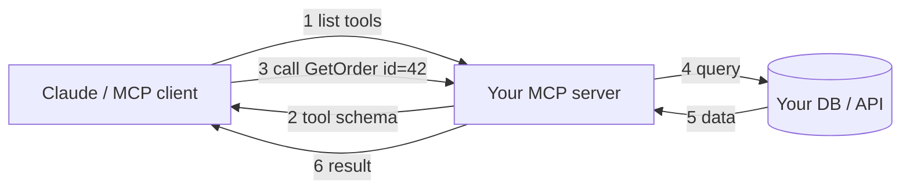

<!--START-->

<div style="padding: 20px 24px; margin: 24px 0; border: 1px solid #334155; border-radius: 12px; background: linear-gradient(135deg, #1e293b 0%, #0f172a 100%);">
<p style="margin: 0 0 8px 0; font-size: 14px; font-weight: 600; text-transform: uppercase; letter-spacing: 0.5px; color: rgba(255,255,255,0.7);">A word from this week's sponsor</p>

<p style="margin: 0 0 12px 0; font-size: 16px; line-height: 1.6; color: #ffffff;">This issue isn't sponsored. Instead, let me point you to something I run every single day: my <strong>AI for .NET Developers Community</strong> - for .NET developers who want to actually use AI on real code. 50+ ready-to-run skills and agents for .NET (a new one added every week), and the room to figure it all out together.</p>

<a href="https://www.skool.com/ai-for-dotnet-developers" target="_blank" rel="noopener noreferrer" style="display: inline-block; padding: 10px 20px; font-size: 16px; font-weight: 700; color: #1a0224; background: #ffbd39; border-radius: 8px; text-decoration: none;">Join the community - 7 days free →</a>

<p style="margin: 16px 0 8px 0; font-size: 13px; line-height: 1.5; color: rgba(255,255,255,0.6);">Want to reach thousands of .NET developers like this?</p>

<a href="https://thecodeman.net/sponsorship" target="_blank" rel="noopener noreferrer" style="display: inline-block; padding: 7px 14px; font-size: 13px; font-weight: 600; color: #ffffff; background: transparent; border: 1px solid #6366f1; border-radius: 8px; text-decoration: none;">Sponsor TheCodeMan →</a>
</div>

**Keywords:** MCP server in .NET, Model Context Protocol C#, ModelContextProtocol NuGet, Claude MCP server C#, connect Claude to your API, C# AI tools, stdio MCP server

## The Problem: Claude Can't Reach Your Code or Data

When you work through a problem with Claude, it often needs data that only your systems have. It asks what an order looks like in the database, so you run the query yourself and paste the result back. Then it needs the config value, so you copy that. Then a log line. Each time, you move something out of your environment by hand and paste it into the chat.

The model is doing the reasoning, but all the fetching is manual.

The Model Context Protocol (MCP) removes that step. It's a standard way to hand an AI model a set of tools it can call on its own - query a database, hit an internal API, read a file - instead of you shuttling data back and forth. You can build one of these servers in C# with a package that Microsoft and Anthropic maintain together.

This is a getting-started guide for exactly that. By the end you'll have an MCP server running in C#, exposing your own methods as tools, connected to Claude.

## What an MCP Server Is

An MCP server is a process that advertises a list of **tools**. Each tool is a function with a name, a description, and typed parameters. A client - Claude Desktop, VS Code, Cursor, or your own app - connects to the server, reads that list, and when the model decides it needs one, the client calls it and feeds the result back into the conversation.

The description matters more than it looks. The model doesn't see your code; it sees the tool's name and description and uses them to decide when to call it. A vague description means the model won't know when the tool applies. A clear one means it picks the right tool without extra prompting.



There are two transports you'll use in practice. **stdio** runs the server as a local child process and talks over standard input/output, which suits a tool that runs on your own machine. **HTTP** runs it as a web service you can host and share with a team. We'll start with stdio because it's the fastest way to see it work, then change one file to switch to HTTP.

## Building the Server

Start with a plain console app and add the two packages you need:

```bash
dotnet new console -n TheCodeMan.Mcp
cd TheCodeMan.Mcp
dotnet add package ModelContextProtocol
dotnet add package Microsoft.Extensions.Hosting
```

The SDK ships in a few packages. `ModelContextProtocol` is the one for a stdio server - it brings hosting, dependency injection, and attribute-based tool discovery. There's a leaner `ModelContextProtocol.Core` if you only need the client, and `ModelContextProtocol.AspNetCore` for HTTP, which we'll get to.

Here's the full `Program.cs`:

```csharp
using Microsoft.Extensions.DependencyInjection;
using Microsoft.Extensions.Hosting;
using Microsoft.Extensions.Logging;
using ModelContextProtocol.Server;
using System.ComponentModel;

var builder = Host.CreateApplicationBuilder(args);

// stdio is the transport, so stdout is reserved for protocol messages.
// Send every log to stderr or you'll corrupt the JSON-RPC stream.
builder.Logging.AddConsole(options =>
{
    options.LogToStandardErrorThreshold = LogLevel.Trace;
});

builder.Services
    .AddMcpServer()
    .WithStdioServerTransport()
    .WithToolsFromAssembly();

await builder.Build().RunAsync();
```

The comment about stderr is the one thing that trips people up the first time. With stdio, the client and server exchange JSON-RPC over stdout. If any part of your app writes to stdout - a stray `Console.WriteLine` - it corrupts the protocol and the client just waits. Route logs to stderr and don't print to stdout yourself.

`WithToolsFromAssembly()` scans the assembly for tool classes so you don't register each one by hand. Next, give it a tool to find.

## Your First Tool

A tool is a method. Mark the class with `[McpServerToolType]`, mark the method with `[McpServerTool]`, and describe both the tool and its parameters:

```csharp
using System.ComponentModel;
using ModelContextProtocol.Server;

[McpServerToolType]
public static class EchoTool
{
    [McpServerTool, Description("Echoes the message back to the client.")]
    public static string Echo(string message) => $"Hello from C#: {message}";
}
```

The `Description` attributes are the interface the model reasons over, not documentation for humans. "Echoes the message back" is what tells Claude when the tool is useful. Write each description as the text the model reads before it decides whether to call the tool.

## Connecting It to Your Real Code

Echo is a hello-world. The point is to expose *your* system - a database, an internal service, a cache. That's where dependency injection comes in, and the C# SDK uses the DI container you already know.

Say you have a service that reads orders. Register it like any other dependency:

```csharp
builder.Services.AddSingleton<OrderService>();

builder.Services
    .AddMcpServer()
    .WithStdioServerTransport()
    .WithToolsFromAssembly();
```

A tool method can then take that service as a parameter, and the SDK injects it from the container the same way a controller action receives its dependencies. The rest of the parameters are values the model fills in:

```csharp
using System.ComponentModel;
using System.Text.Json;
using ModelContextProtocol.Server;

[McpServerToolType]
public static class OrderTools
{
    [McpServerTool, Description("Gets a single order by its numeric id.")]
    public static async Task<string> GetOrder(
        OrderService orders,
        [Description("The numeric id of the order to fetch")] int id)
    {
        var order = await orders.GetByIdAsync(id);
        return order is null
            ? $"No order found with id {id}."
            : JsonSerializer.Serialize(order);
    }

    [McpServerTool, Description("Lists recent orders for a customer by email.")]
    public static async Task<string> GetOrdersForCustomer(
        OrderService orders,
        [Description("The customer's email address")] string email)
    {
        var results = await orders.GetRecentByEmailAsync(email);
        return JsonSerializer.Serialize(results);
    }
}
```

Note the split: `OrderService` comes from DI, while `id` and `email` come from the model. Returning JSON is a reasonable default - it's structured enough for the model to parse and turn into a table or a summary. Behind `OrderService` there's nothing special: EF Core, Dapper, or an HTTP call to another service. MCP doesn't care how you get the data, only that you describe the tool well and return something readable.

A few habits that help once real callers use these tools:

- **Return a clear message on the empty case**, like the "No order found" string above. The model handles an explicit "nothing matched" better than an empty payload it has to guess about.
- **Keep parameter lists small and name them for what they are.** `email` is better than `param1`, because the model maps the user's intent onto the parameter names.
- **Don't expose more than the task needs.** A tool that reads any order is convenient; one that reads any order *and* refunds it is risky. Scope tools to what you'd let an assistant do without supervision.

## Pointing Claude at It

With the server building, register it with the client. For Claude Desktop, that's the `claude_desktop_config.json` file (Settings → Developer → Edit Config). Add your server under `mcpServers`:

```json
{
  "mcpServers": {
    "thecodeman-orders": {
      "command": "dotnet",
      "args": [
        "run",
        "--project",
        "C:\\code\\TheCodeMan.Mcp\\TheCodeMan.Mcp.csproj"
      ]
    }
  }
}
```

Restart the client. You don't run the project yourself - the client launches it as a child process over stdio, reads the tool list, and shows the tools as available. Ask it something that needs one, such as "what's on order 42?", and it will ask permission to call `GetOrder`, run it, and answer from the result. The same config shape works in VS Code and other MCP clients; only the file location changes.

## When a Team Needs It: Go HTTP

stdio works for a tool that runs on your machine. When you want a server a team - or a deployed app - can reach, switch to HTTP. That's a different package and a slightly different `Program.cs`, but the tool classes don't change at all:

```bash
dotnet new web -n TheCodeMan.Mcp.Http
dotnet add package ModelContextProtocol.AspNetCore
```

```csharp
using ModelContextProtocol.Server;

var builder = WebApplication.CreateBuilder(args);

builder.Services
    .AddMcpServer()
    .WithHttpTransport(options =>
    {
        // Stateless is fine when you don't need server-to-client
        // callbacks like sampling or elicitation.
        options.Stateless = true;
    })
    .WithToolsFromAssembly();

var app = builder.Build();
app.MapMcp();
app.Run("http://localhost:3001");
```

Same `[McpServerTool]` methods, same DI. One security note: for local HTTP servers, keep `AllowedHosts` limited to loopback values rather than `"*"`, and only enable CORS if you actually need browser access. An MCP endpoint that reaches into your data shouldn't be reachable by a stray web page through DNS rebinding. The SDK docs cover the exact host-filtering and CORS setup.

## Where This Gets Useful

The echo-and-orders example is small so the mechanics are clear. What makes it useful is what a tool can be. A tool is a C# method, so it can:

- Query your production read-replica and answer "how many signups yesterday" without you writing the SQL by hand.
- Call an internal microservice the model would otherwise have no way to reach.
- Kick off a report, read a feature-flag state, or look up a customer record - each as its own described tool.

You aren't teaching the model your codebase. You give it a set of tools, each with a clear description, and it chooses which to call when it needs them.

## FAQ

### What's the difference between an MCP server and just calling the Claude API?

With the API, your code drives the conversation and decides what to send. With an MCP server, you expose tools and the model decides when to call them during a conversation you didn't script. The API is your code calling Claude; MCP gives Claude a set of controlled hooks into your systems.

### Do I need a specific .NET version?

The `ModelContextProtocol` packages target modern .NET, so a current LTS or later is the safe bet. If `dotnet new console` gives you a recent SDK, you're fine. The API surface shown here - `AddMcpServer`, `WithStdioServerTransport`, the attributes - is what the official C# SDK exposes today.

### Why do my logs break the server?

Because with stdio, stdout *is* the protocol channel. Anything you print to stdout gets parsed as a JSON-RPC message and corrupts the stream. Send logs to stderr (as in the `Program.cs` above) and never `Console.WriteLine` to stdout from a stdio server.

### stdio or HTTP - which should I pick?

stdio for a personal, local tool that runs on your machine next to the client. HTTP when you want to deploy it and let a team or an app connect over the network. Start with stdio to learn it; the tool code is identical when you move to HTTP.

## Wrapping Up

An MCP server in .NET is a small thing: a console app, two packages, and methods you mark with an attribute and describe. The description is the part that matters, since it's what the model uses to decide when to call each tool. Once the server is in place, Claude can pull the data it needs instead of asking you to copy and paste it.

Start with the smallest useful tool. Pick one question you keep answering by hand - "what's the status of order X", "how many of Y yesterday" - wrap the query you already have in a `[McpServerTool]` method, and point Claude at it over stdio. Once it's calling your own code, adding more tools is the same pattern repeated.

For the official reference and full samples, the [MCP C# SDK](https://github.com/modelcontextprotocol/csharp-sdk) and the [.NET Blog walkthrough](https://devblogs.microsoft.com/dotnet/build-a-model-context-protocol-mcp-server-in-csharp/) are both worth a read.

If you made it this far, you're serious about production-grade .NET systems. Use code **DEEP20** for a discount on [Design Patterns that Deliver](/design-patterns-that-deliver-ebook).

That's all from me today.

<!--END-->
