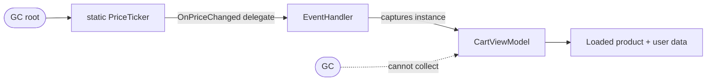

<div style="padding: 20px 24px; margin: 24px 0; border: 1px solid #334155; border-radius: 12px; background: linear-gradient(135deg, #1e293b 0%, #0f172a 100%);">
<p style="margin: 0 0 8px 0; font-size: 14px; font-weight: 600; text-transform: uppercase; letter-spacing: 0.5px; color: rgba(255,255,255,0.7);">A quick word from me</p>

<p style="margin: 0 0 12px 0; font-size: 16px; line-height: 1.6; color: #ffffff;">This issue isn't sponsored. Instead, let me point you to something I run every single day: my <strong>AI for .NET Developers Community</strong> - for .NET developers who want to actually use AI on real code. 50+ ready-to-run skills and agents for .NET (a memory-profiling helper included), a new one added every week, and the room to figure it all out together.</p>

<a href="https://www.skool.com/thecodeman-ai-toolkit-9723" target="_blank" rel="noopener noreferrer" style="display: inline-block; padding: 10px 20px; font-size: 16px; font-weight: 700; color: #1a0224; background: #ffbd39; border-radius: 8px; text-decoration: none;">Join the community - 7 days free →</a>

<p style="margin: 16px 0 8px 0; font-size: 13px; line-height: 1.5; color: rgba(255,255,255,0.6);">Want to reach thousands of .NET developers like this?</p>

<a href="https://thecodeman.net/sponsorship" target="_blank" rel="noopener noreferrer" style="display: inline-block; padding: 7px 14px; font-size: 13px; font-weight: 600; color: #ffbd39; background: transparent; border: 1px solid #ffbd39; border-radius: 8px; text-decoration: none;">Sponsor TheCodeMan →</a>
</div>

**Keywords:** memory leak .NET, diagnose memory leak production, dotnet-counters, dotnet-gcdump, dotnet-dump, managed heap growth, Gen 2 GC, static event memory leak, GC roots, gcroot, IDisposable unsubscribe, HttpClient socket exhaustion, captured closure leak, .NET memory profiling

## The Graph That Only Went Up

The alert came in at 6 a.m.: a service getting OOM-killed and restarting every few hours. Not crashing - restarting. Kubernetes would kill the pod when it crossed its memory limit, a fresh one would spin up, memory would climb again, and the cycle repeated. From the outside it looked healthy. Requests were served, latency was fine. The only tell was the memory graph, and it did one thing: it went up. A slow, stubborn diagonal line that never came back down.

That line is the whole story of a memory leak in .NET. Not a spike - a spike is a big request or a burst of load, and it recovers. A leak is monotonic. It climbs, a garbage collection shaves a little off, and then it climbs past the previous peak anyway. Give it long enough and the process dies. This one took about four hours to go from healthy to killed, which meant I had a slow leak, a few hundred megabytes an hour, hiding somewhere in a .NET 10 API that had been running fine for months.

Here's how I actually found it - the tools I reached for, in order, and the reasoning at each step. The culprit turned out to be four lines of code nobody had thought about in a year.

## Why "Just Restart It" Isn't a Fix

The tempting move is to bump the memory limit or add a scheduled restart and move on. I've done it under pressure. It buys you a night's sleep and costs you the next incident, because the leak is still there - you've just widened the runway. Worse, a scheduled restart hides the signal, so the next person to touch that service inherits a problem with no graph pointing at it.

A leak is also a correctness smell, not only a resource one. Something is holding references it shouldn't. That same bug is often holding *stale* data - an object that should have been replaced but is being kept alive by the exact reference that's leaking it. Fixing the leak frequently fixes a subtle staleness bug you didn't know you had. So it's worth the three days. Let's find it.

## Step 1: Confirm It's Actually a Leak

Before capturing anything heavy, I confirm the shape of the problem with [`dotnet-counters`](https://learn.microsoft.com/en-us/dotnet/core/diagnostics/dotnet-counters). It's cheap, it runs against a live process, and it tells me whether I'm chasing a leak or a mirage:

```bash
dotnet-counters monitor -p <pid> \
  --counters System.Runtime[dotnet.gc.heap.size,dotnet.gc.gen_2.size,dotnet.gc.collections]
```

What I'm watching for is the managed heap size and Gen 2 over several minutes. Two very different pictures:

- **Heap climbs, then drops back after a Gen 2 collection** - not a leak. That's a cache filling up, or just GC being lazy because there's no memory pressure. Annoying, not fatal.
- **Heap climbs, a Gen 2 collection runs, and it *doesn't* drop** - that's the one. Objects are surviving collection after collection, which means something reachable is holding them.

Mine was the second picture. Gen 2 kept growing across collections, which is the fingerprint of objects being promoted and then pinned alive. Now I know it's real, it's managed (not native), and it's in long-lived objects. Time to look at the heap itself.

## Step 2: Capture the Heap Without Killing the Process

For a suspected leak, my first snapshot tool is [`dotnet-gcdump`](https://learn.microsoft.com/en-us/dotnet/core/diagnostics/dotnet-gcdump), not a full dump. A gcdump captures only the managed heap graph - types, counts, sizes, and the references between objects. It's small (megabytes, not gigabytes), and it's safe to take on a live process because it triggers one GC and walks the resulting graph.

The trick that actually finds the leak is taking **two** snapshots, minutes apart, under the same load:

```bash
# Snapshot A
dotnet-gcdump collect -p <pid> -o leak-A.gcdump

# ...wait 5-10 minutes while the leak grows...

# Snapshot B
dotnet-gcdump collect -p <pid> -o leak-B.gcdump
```

One snapshot tells you what's on the heap. Two snapshots tell you what's *growing*, and growth is the leak. A single dump is a photo; two dumps are a diff, and the diff is the whole game. Open both in Visual Studio (File → Open → the `.gcdump`) or PerfView, and compare object counts between A and B.

## Step 3: Find What Keeps Growing

Sorted by count, snapshot B had thousands more `CartViewModel` instances than A - and nothing in the request path should keep a `CartViewModel` alive past a request. That's the leaking type. But knowing *what* leaks isn't enough; I need to know *who's holding it*, because that reference is the actual bug.

This is where the GC root path matters. Every object that survives collection does so because there's an unbroken chain of references from a **root** - a static field, a thread stack, a GC handle - down to it. If I follow that chain, it ends at whatever is refusing to let go.

If you prefer the command line or you only have a full dump, [`dotnet-dump`](https://learn.microsoft.com/en-us/dotnet/core/diagnostics/dotnet-dump) gives you the same answer through SOS:

```bash
dotnet-dump collect -p <pid> -o full.dmp
dotnet-dump analyze full.dmp
```

```text
> dumpheap -stat -type CartViewModel
Statistics:
      MT    Count    TotalSize Class Name
7ffa...    14832     23731200 MyApp.Web.CartViewModel

> dumpheap -type CartViewModel      # grab one address from the list
> gcroot 00007ffa9c1d4a80
```

`gcroot` is the punchline. It prints the reference chain holding that object alive, from the root down. Mine looked like this - and the moment I saw it, I knew:

```text
HandleTable:
  -> MyApp.Events.PriceTicker           (static)
  -> System.EventHandler<PriceChangedArgs>
  -> MyApp.Web.CartViewModel
```

A **static** publisher, holding a delegate, holding my view model. Here's the shape of it drawn out:



The garbage collector was doing its job perfectly. These objects were *reachable*. It had no choice but to keep them.

## The Culprit: A Static Event Nobody Unsubscribed From

Here's the code, lightly renamed. A long-lived, static price ticker that everything subscribes to for live updates:

```csharp
public static class PriceTicker
{
    // Static - lives for the entire lifetime of the process.
    public static event EventHandler<PriceChangedArgs>? PriceChanged;

    public static void Publish(PriceChangedArgs args)
        => PriceChanged?.Invoke(null, args);
}
```

And the view model that subscribes to it when it's built per request:

```csharp
public class CartViewModel
{
    public CartViewModel()
    {
        // Subscribe so the cart updates when prices move.
        PriceTicker.PriceChanged += OnPriceChanged;
    }

    private void OnPriceChanged(object? sender, PriceChangedArgs e)
    {
        /* recalculate cart totals */
    }

    // ...and no unsubscribe. Anywhere.
}
```

Read that subscription line again, because the direction of the reference is the entire bug. When you write `PriceTicker.PriceChanged += OnPriceChanged`, the *static event* now holds a delegate, and that delegate holds a reference to `this` - the `CartViewModel`. The instance points at the static event, sure, but that's harmless. It's the reference going the *other* way - static event to instance - that pins it.

So every request built a `CartViewModel`, wired it to a process-lifetime static event, and walked away. The request ended, the response went out, and the GC came around and found a live root chain straight to that view model. It could never be collected. Fourteen thousand of them and counting, each dragging along whatever product and user data it had loaded. Four lines, a slow diagonal line on a graph, a pod killed every four hours.

## The Fix: Unsubscribe, or Don't Subscribe at All

The direct fix is to make the object release the subscription when it's done. Implement `IDisposable` and unsubscribe there:

```csharp
public class CartViewModel : IDisposable
{
    public CartViewModel()
        => PriceTicker.PriceChanged += OnPriceChanged;

    private void OnPriceChanged(object? sender, PriceChangedArgs e)
    {
        /* recalculate cart totals */
    }

    public void Dispose()
        => PriceTicker.PriceChanged -= OnPriceChanged;   // break the chain
}
```

`-=` removes exactly the delegate you added, which breaks the reference from the static event to the instance. Now, once the request scope disposes the view model, the chain is cut and the GC can finally collect it. In an ASP.NET Core app, registering the type as scoped means the DI container disposes it at the end of the request for you - as long as it actually implements `IDisposable`, which was the missing half.

But honestly, the better fix here was to question the design. A per-request object subscribing to a process-lifetime static event is a mismatch of lifetimes, and lifetime mismatches are where leaks live. The cleaner version pushes the subscription into a single long-lived service and lets requests read the latest value instead of each wiring themselves to the publisher:

```csharp
// One subscriber for the whole app, not one per request.
public sealed class PriceCache : IDisposable
{
    private volatile PriceSnapshot _latest = PriceSnapshot.Empty;

    public PriceCache() => PriceTicker.PriceChanged += OnPriceChanged;

    private void OnPriceChanged(object? sender, PriceChangedArgs e)
        => _latest = e.Snapshot;

    public PriceSnapshot Current => _latest;   // requests just read this

    public void Dispose() => PriceTicker.PriceChanged -= OnPriceChanged;
}
```

Register `PriceCache` as a singleton, inject it into the view model, and the per-request object holds no subscription at all. Nothing to leak. When the lifetimes match - one long-lived subscriber for a long-lived event - the whole class of bug disappears.

Diagnosing this by hand is a skill worth having, but it's also exactly the kind of tedious pattern-matching I've handed to tooling. The memory-profiling helper in my [AI for .NET Developers Community](https://www.skool.com/thecodeman-ai-toolkit-9723) flags per-request types that subscribe to static or singleton events without a matching unsubscribe - the leak above, caught in review instead of at 6 a.m.

## The Other Usual Suspects

The static event was mine this time, but a leak hunt has a short list of prime suspects, and they show up in the same `gcroot` output. Knowing them turns a three-day hunt into a three-hour one:

- **A new `HttpClient` per request.** Not a managed-heap leak exactly, but the same graph shape of harm - it leaks *sockets*. Each `new HttpClient()` opens connections that linger in `TIME_WAIT`, and under load you exhaust ports. Use `IHttpClientFactory`, always.
- **Captured closures in a long-lived collection.** A lambda that captures a big object and gets stored in a static list, a cache, or an event keeps that whole object alive. The closure is invisible in the source but very visible in `gcroot`.
- **Timers that outlive their owner.** `System.Threading.Timer` and `System.Timers.Timer` hold a reference to their callback target. If you don't dispose the timer, its target - and everything it captures - never dies.
- **Ever-growing static caches.** A `static Dictionary` used as a cache with no eviction is a leak with a nicer name. Bound it, or use a real cache with a size limit.
- **Undisposed `IDisposable` in a loop.** Streams, DB connections, and anything wrapping native handles. Wrap them in `using`; the analyzer `CA2000` will point at most of them.

Every one of these ends the same way in a dump: a root you didn't expect, holding an object you thought was long gone.

## A Checklist Before You Ship

The line I actually use, so I don't end up back at 6 a.m.:

- **Subscribed to an event on something longer-lived than you?** Unsubscribe in `Dispose`, no exceptions. Per-request objects should almost never subscribe to static or singleton events.
- **Implementing `IDisposable`?** Make sure something actually disposes it - scoped DI registration, a `using`, or an explicit call.
- **Reaching for `new HttpClient()`?** Stop. Inject `IHttpClientFactory`.
- **Adding to a `static` collection?** Ask what evicts from it. If the answer is "nothing," that's a leak with a delayed fuse.
- **Watching a suspicious graph?** `dotnet-counters` first to confirm, two `dotnet-gcdump` snapshots to find the growing type, `gcroot` to name the culprit. In that order.

## FAQ

### How do I find a memory leak in a .NET application?

Start by confirming it's a real leak and not just a large cache or delayed GC - watch the managed heap size and Gen 2 with `dotnet-counters` over time. If it only climbs and never drops after a full GC, capture a heap snapshot with `dotnet-gcdump` (or `dotnet-dump` for a full dump), then compare two snapshots taken minutes apart to see which object type keeps growing. Once you know the type, trace its GC roots with `gcroot` to find what's holding it alive - that reference is the leak.

### What's the difference between dotnet-gcdump and dotnet-dump?

`dotnet-gcdump` captures only the managed heap graph - object types, counts, sizes, and references - and it's small and safe to take on a live process, which makes it the right first tool for a suspected leak. `dotnet-dump` captures a full process dump including native memory, threads, and stacks; it's much bigger but lets you inspect actual object contents and call stacks. Use gcdump to find what's leaking, dump when you need to see why.

### Why doesn't the .NET garbage collector free my leaked objects?

The GC only collects objects that are unreachable. If anything still holds a reference to an object - a static field, an event subscription, a long-lived collection, a captured closure, or a running timer - that object is a live root and the GC must keep it, along with everything it references. A "memory leak" in managed .NET is almost always an unintended reference you forgot to release, not a GC failure.

### Do static events cause memory leaks in .NET?

Yes, and they're one of the most common causes. When an instance subscribes to a static (or any long-lived) event and never unsubscribes, the event's delegate holds a reference to that instance for the lifetime of the publisher. The instance - and everything it captured - can never be collected. Always unsubscribe in `Dispose`, or use a weak-event pattern for long-lived publishers.

## Wrapping Up

A memory leak in managed .NET is almost never the garbage collector's fault. The GC is ruthless and correct: if an object is reachable, it stays. A leak is you handing it a reference you forgot about and then being surprised it honored it. The whole job of the hunt is finding that one reference.

The method holds up every time. Confirm the shape with `dotnet-counters` so you're not chasing a cache. Take two `dotnet-gcdump` snapshots under load and diff them to find the type that grows. Run `gcroot` on one instance to see who's holding it. The chain always ends somewhere concrete - a static event, a timer, a closure, a cache with no eviction - and once you can see the chain, the fix is usually a single line: unsubscribe, dispose, bound the cache, or fix the lifetime mismatch that created the reference in the first place.

Mine was four lines and three days. Yours will be shorter now, because you know exactly which three tools to reach for and in what order. And if you'd rather have this kind of pattern - the per-request object wired to a process-lifetime event - caught in review instead of on a 6 a.m. graph, that's the sort of thing the skills and agents in my [AI for .NET Developers Community](https://www.skool.com/thecodeman-ai-toolkit-9723) do on your real code, with a new one added every week.

That's all from me today.

<!--END-->
