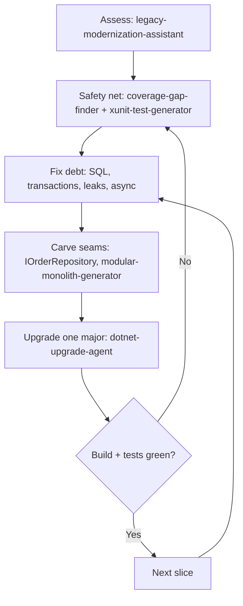

<!--START-->

<div style="padding: 20px 24px; margin: 24px 0; border: 1px solid #334155; border-radius: 12px; background: linear-gradient(135deg, #1e293b 0%, #0f172a 100%);">
<p style="margin: 0 0 8px 0; font-size: 14px; font-weight: 600; text-transform: uppercase; letter-spacing: 0.5px; color: rgba(255,255,255,0.7);">A quick word from me</p>

<p style="margin: 0 0 12px 0; font-size: 16px; line-height: 1.6; color: #ffffff;">This issue isn't sponsored. Instead, let me point you to something I run every single day: my <strong>AI for .NET Developers Community</strong> - for .NET developers who want to actually use AI on real code. 50+ ready-to-run skills and agents for .NET (the legacy and upgrade agents in this post included), a new one added every week, and the room to figure it all out together.</p>

<a href="https://www.skool.com/thecodeman-ai-toolkit-9723/about" target="_blank" rel="noopener noreferrer" style="display: inline-block; padding: 10px 20px; font-size: 16px; font-weight: 700; color: #1a0224; background: #ffbd39; border-radius: 8px; text-decoration: none;">Join the community - 7 days free →</a>

<p style="margin: 16px 0 8px 0; font-size: 13px; line-height: 1.5; color: rgba(255,255,255,0.6);">Want to reach thousands of .NET developers like this?</p>

<a href="https://thecodeman.net/sponsorship" target="_blank" rel="noopener noreferrer" style="display: inline-block; padding: 7px 14px; font-size: 13px; font-weight: 600; color: #ffffff; background: transparent; border: 1px solid #6366f1; border-radius: 8px; text-decoration: none;">Sponsor TheCodeMan →</a>
</div>

**Keywords:** refactor legacy .NET, modernize legacy .NET codebase, .NET Framework to modern .NET, strangler fig pattern, characterization tests, .NET upgrade, Claude for .NET refactoring, AI code modernization

## The Problem: A Legacy Codebase You're Afraid to Touch

Most .NET teams have one: a service that's been running for years, still on .NET Framework, with `new`-ed up dependencies instead of DI, sync-over-async in places, and few or no tests. It works, and that's why nobody wants to change it - any change might break something no one fully understands anymore.

When people reach for AI here, the first instinct is usually the worst one: "rewrite it in modern .NET." Paste the old class in, ask for a clean version, repeat. That produces a pile of plausible-looking new code with no safety net, and you find out what you broke in production.

I use Claude on legacy code a lot, but not that way. The value isn't in generating a rewrite - it's in running a disciplined, incremental modernization where the system keeps working the whole time. To make this concrete I'll use a small .NET Framework 4.8 sample, `LegacyErp` - a WinForms app over a Dapper/ADO.NET data layer - and walk the exact workflow and the .NET agents I use at each step.

## Why "Rewrite It From Scratch" Fails

A big-bang rewrite fails for the same reasons whether a human or an AI writes it. You freeze feature work while the rewrite drags on. You reproduce old bugs and add new ones. And you have no way to prove the new code behaves like the old code, because the old behavior was never written down - it only exists in the running system.

The alternative is the strangler-fig approach: wrap the old system, replace it piece by piece, and keep shipping the whole time. It's slower to start and far safer to finish. That's the principle every step below is built around.

## Step 1: Assess Honestly Before Changing Anything

The first job isn't to change code, it's to understand it. I point Claude at the repository with a `legacy-modernization-assistant` agent whose whole job is to read the codebase and produce a sequenced roadmap - not to start editing. It's deliberately constrained to read-only tools:

```markdown
---
name: legacy-modernization-assistant
description: Assesses a legacy .NET codebase and produces a pragmatic,
  incremental modernization roadmap, prioritized by risk and value.
tools: Read, Glob, Grep, Bash
---

## Operating principles
- Incremental over rewrite. Strangler-fig: wrap and replace piece by piece.
- Risk x value sequencing. Start where modernization is safe and pays off.
- Tests first where you'll change most.
- Be honest, not demoralizing. Name the debt plainly, give a doable path.
```

Run against `LegacyErp`, here's the actual roadmap it produced (trimmed):

```text
# Modernization Roadmap — LegacyErp

## Honest assessment
Two-project .NET Framework 4.8 solution: a LegacyErp.Data class library
(Dapper/ADO.NET) and a LegacyErp.UI WinForms app. Old-style non-SDK .csproj,
packages.config. Small, but it carries most of the classic legacy risks at
once - and several are correctness or security bugs, not just "old style".

Load-bearing risks are in OrderRepository: a single SqlConnection opened in
the constructor and held open forever, SQL built by string concatenation
(injectable), no using on command/reader, and two stock writes that must be
atomic with no transaction. Serialize() uses BinaryFormatter - a security
hole and removed on modern .NET, so a hard migration blocker.

Platform blockers: System.Web referenced from a data library, System.ServiceModel
(WCF) in the UI, BinaryFormatter, and a Newtonsoft.Json version split (12.0.3
vs 13.0.1). WinForms itself runs on modern .NET, so the target is reachable.
No tests. Nothing can be safely refactored until that changes.

## Roadmap (incremental, sequenced)
Phase 1 — safe foundations: fix the SQL injection + missing transaction in
place on net48 behind characterization tests; packages.config -> PackageReference;
old .csproj -> SDK-style; introduce IOrderRepository + injected connection string.
Phase 2 — carve seams: connection-per-operation; make the data layer async;
fix UI threading + the static-event leak; replace BinaryFormatter.
Phase 3 — migrate: net48 -> .NET 8 -> .NET 9 one major at a time (verify between);
replace the WCF client; retarget WinForms to modern .NET.

## Quick wins
Parameterize SQL + add the TransferStock transaction; unsubscribe from the
static event; try/catch the async void handler; collapse Newtonsoft to one version.
```

Giving the agent read-only tools for this pass matters. It can't "helpfully" start rewriting a class before you've decided anything, which is exactly the failure mode you're avoiding. You read the roadmap, you approve the sequence, and only then does anything change.

## Step 2: Build the Safety Net First

You can't refactor code you can't verify. Before touching the risky parts, I get tests around the current behavior - characterization tests, which capture what the code does now, correct or not, so you'll notice if a refactor changes it.

Two skills do the heavy lifting. `test-coverage-gap-finder` reads the codebase and reports which paths have no tests, ranked by how risky they are to change untested - in `LegacyErp` that's `SearchOrders` and `TransferStock` at the top. Then `xunit-test-generator` writes xUnit tests for the specific methods I'm about to change. The point isn't 100% coverage - it's a net under the exact code the next steps will touch.

## Step 3: Fix the Debt, With the Tests Watching

Now the changes from the roadmap, in order of risk. Start with the ones that are security or correctness bugs.

**SQL injection + a connection held open + sync I/O.** Here's the real `SearchOrders` from the sample:

```csharp
// Before: injectable, sync, shared connection never disposed
private SqlConnection _conn; // opened once in the constructor, held open

public DataTable SearchOrders(string customerName)
{
    string sql = "SELECT * FROM Orders WHERE CustomerName = '" + customerName + "'";
    SqlCommand cmd = new SqlCommand(sql, _conn);      // no using
    SqlDataReader reader = cmd.ExecuteReader();        // no using, sync
    // ...
}
```

The fix parameterizes the query, opens a connection per call, disposes everything, and goes async - all safe now because Step 2 put a test around the behavior:

```csharp
// After: parameterized, connection-per-call, disposed, async
public async Task<List<Order>> SearchOrdersAsync(string customerName)
{
    const string sql = "SELECT * FROM Orders WHERE CustomerName = @name";
    using var conn = new SqlConnection(_connectionString);
    using var cmd = new SqlCommand(sql, conn);
    cmd.Parameters.AddWithValue("@name", customerName);

    await conn.OpenAsync();
    using var reader = await cmd.ExecuteReaderAsync();

    var orders = new List<Order>();
    while (await reader.ReadAsync())
        orders.Add(Map(reader));
    return orders;
}
```

**A static event nobody unsubscribed from.** The WinForms `MainForm` subscribes to a process-lifetime static event and never lets go, which keeps the form (and everything it holds) alive - a textbook [.NET memory leak](/posts/hunting-a-memory-leak-in-production-dotnet):

```csharp
// Before: subscribed in the constructor, never unsubscribed
public MainForm()
{
    InitializeComponent();
    AppEvents.DataChanged += OnDataChanged;
}

// After: unsubscribe when the form is disposed
protected override void Dispose(bool disposing)
{
    if (disposing)
        AppEvents.DataChanged -= OnDataChanged;
    base.Dispose(disposing);
}
```

The same pass covers the rest of the roadmap's mechanical items: wrap `TransferStock`'s two writes in a transaction, add a `try/catch` to the `async void` click handler, and replace `BinaryFormatter` with `System.Text.Json` before any framework bump. Each is a small, reviewable change with a test behind it.

## Step 4: Carve Seams, Then Upgrade

With the debt cleared, you reshape structure. Introduce `IOrderRepository` so the UI stops `new`-ing the data layer and can be injected and tested. In a bigger ball of mud, a `modular-monolith-generator` helps pull a tangled area into a module with a clear edge - a strangler boundary you can later replace without touching the rest.

The platform upgrade is its own agent, because it's a different kind of work with a different safety discipline:

```markdown
---
name: dotnet-upgrade-agent
description: Plans and executes a .NET version upgrade across a solution -
  target framework bumps, breaking-change remediation, package updates.
tools: Read, Glob, Grep, Bash, Edit
---

## Operating principles
- Incremental, not big-bang. Upgrade one major at a time (6->8, then 8->9).
- Plan before editing. Show the plan and get approval before changing files.
- Verify continuously. Build and run tests after each stage.
- Cite sources for breaking changes rather than guessing.
```

For `LegacyErp` that means net48 to .NET 8, verify green, then .NET 8 to .NET 9 - not a jump straight to the newest. It builds and tests between each hop, and when something needs a human decision (the WCF client has no drop-in modern equivalent) it stops and asks instead of guessing.

## How the Steps Fit Together

The whole thing is a loop with a safety net at its center, not a straight line to a rewrite:



Each slice goes through the same cycle. The agents do the tedious, mechanical, easy-to-get-wrong parts; you make the judgment calls and keep the build green.

## Practical Rules That Keep This Safe

A few rules I don't skip:

- **Assess with read-only tools.** The planning pass should not be able to edit files. Let it produce a roadmap you approve before anything changes.
- **No refactor without a test around it.** If you can't characterize the current behavior, write that test first, then refactor.
- **Fix security and correctness bugs first, even on the old framework.** SQL injection and a missing transaction shouldn't wait for a migration.
- **One major version per upgrade step.** Verify a green build between hops. Never leave the build red overnight.
- **Keep changes small and reviewable.** A big AI diff can hide a big mistake, so keep each slice small enough to actually read before you accept it.

## FAQ

### Can Claude just rewrite my legacy .NET app in one go?

It can produce something that looks like a rewrite, but you shouldn't ship it. A rewrite with no characterization tests and no incremental verification is how you move old bugs into new code and add fresh ones. The safer use is an incremental, test-backed modernization where the app keeps working at every step.

### What's a characterization test and why write it before refactoring?

It's a test that captures what the code currently does - even if that behavior is odd - so you have a baseline. When you then refactor, a failing characterization test tells you the refactor changed behavior. Without it, you're changing legacy code blind.

### Should I upgrade straight to the newest .NET?

For a legacy jump, no. Upgrade one major at a time (for example net48 to .NET 8, then 8 to 9), building and testing between each. Each hop has its own breaking changes, and doing them one at a time keeps the failures small and findable.

### Where does the AI actually help most?

On the mechanical, repetitive work: finding untested paths, generating tests, parameterizing SQL, walking async through a call chain, replacing obsolete APIs like `BinaryFormatter`. You keep the architectural judgment; the assistant clears the tedious volume.

## Wrapping Up

Refactoring legacy .NET with Claude works when you treat it as a workflow, not a rewrite button. Assess the codebase honestly with a read-only pass and get a sequenced roadmap. Put tests around the code you're about to change. Fix the security and correctness bugs first - the SQL injection, the missing transaction, the leak - with the tests watching your back. Then carve seams and upgrade the platform one verified major version at a time.

None of these steps are new; they're the same discipline good engineers have always used on legacy systems. What's changed is that the tedious parts - the assessment, the test scaffolding, the mechanical rewrites - can be handed to agents that follow the discipline instead of shortcutting it. The `LegacyErp` sample and the agents in this post are ones I run on real .NET code; they live in my [AI for .NET Developers Community](https://www.skool.com/thecodeman-ai-toolkit-9723/about), with a new one added every week.

That's all from me today.

<!--END-->
