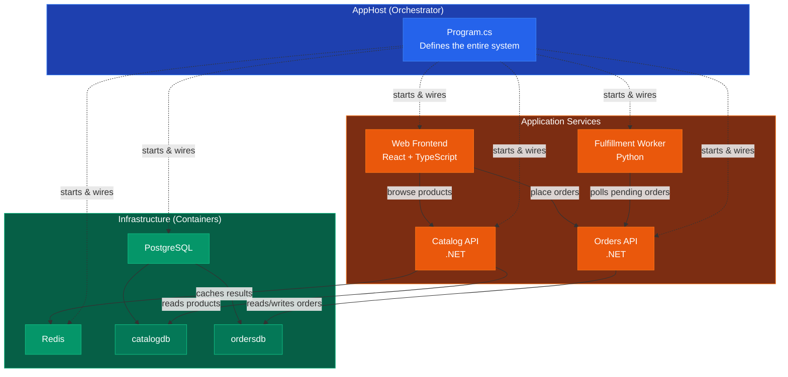
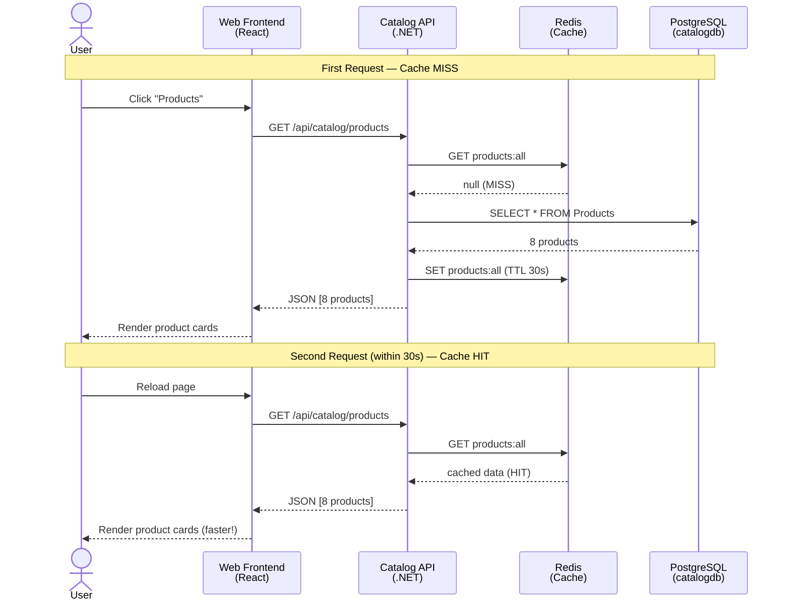
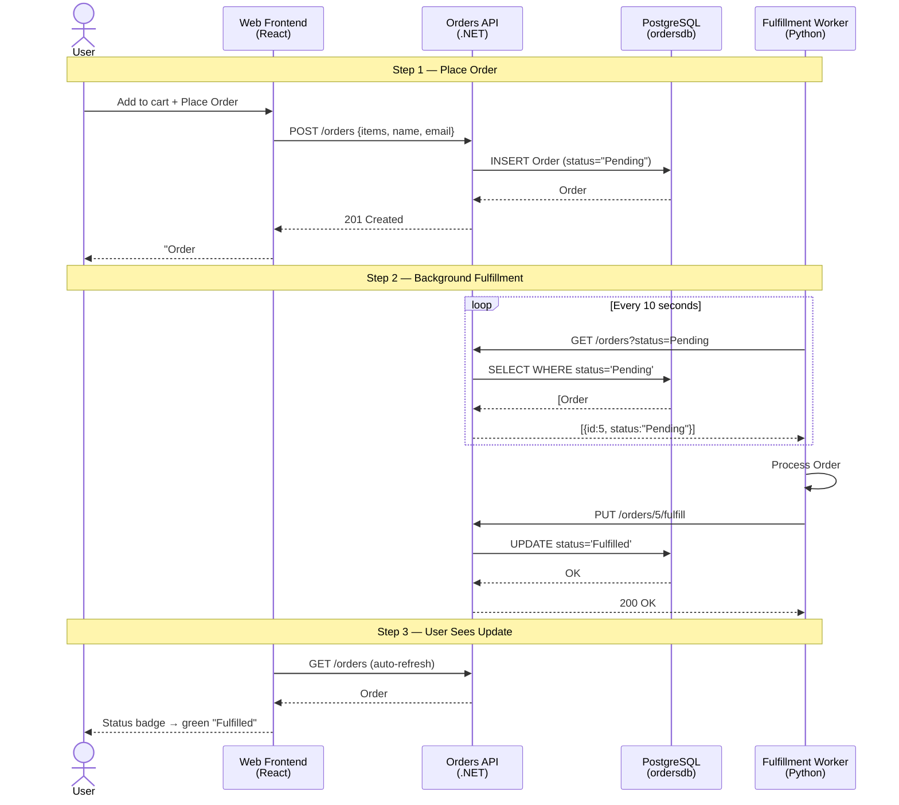
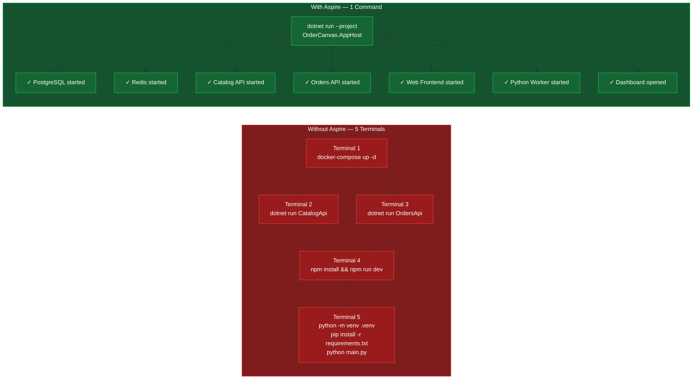

# Mermaid Diagram Sources

Use these to generate the PNG images referenced in the blog post.

---

## 1. architecture-overview.png

---

## 2. product-browse-flow.png

---

## 3. order-fulfillment-flow.png

---

## 4. without-vs-with-aspire.png

